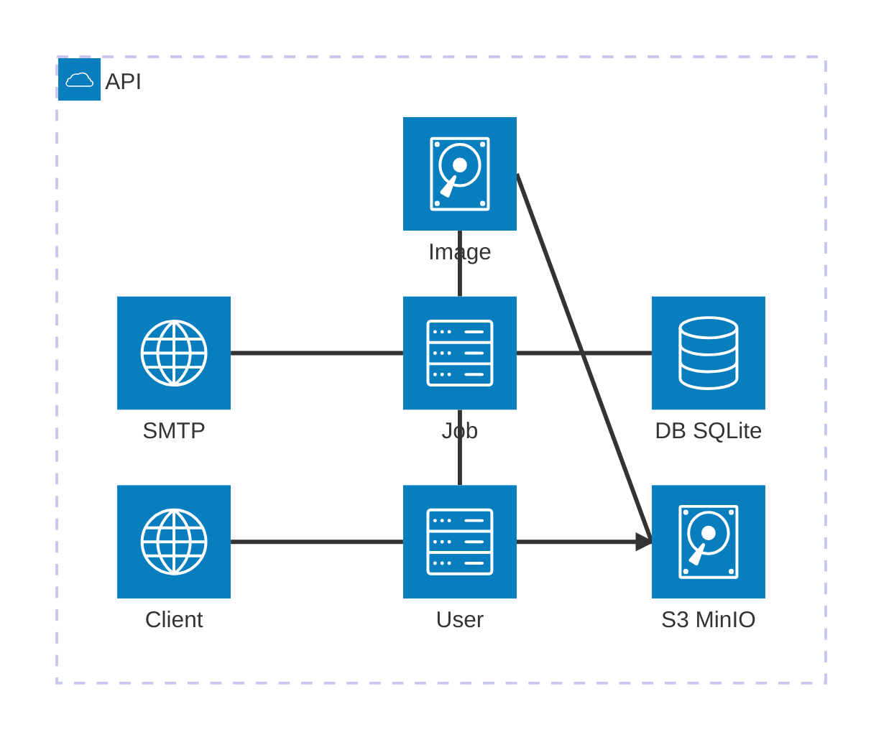
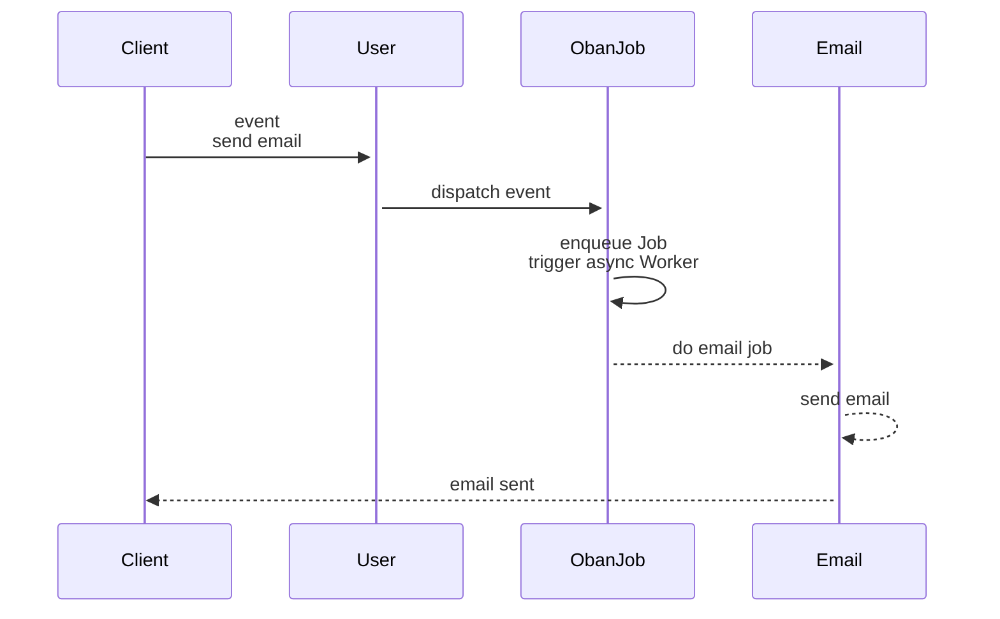
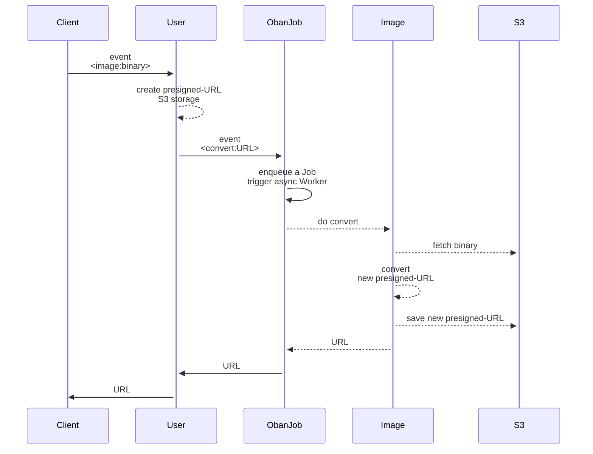
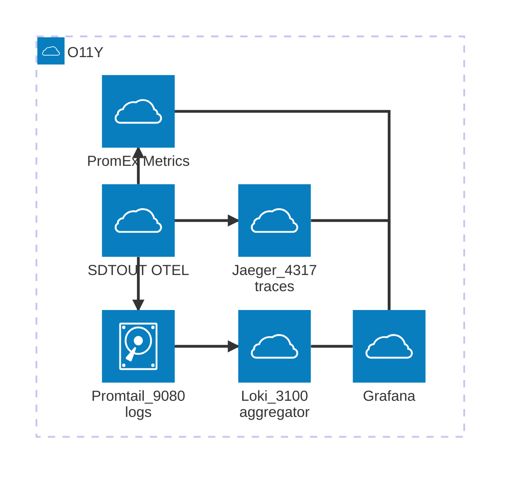
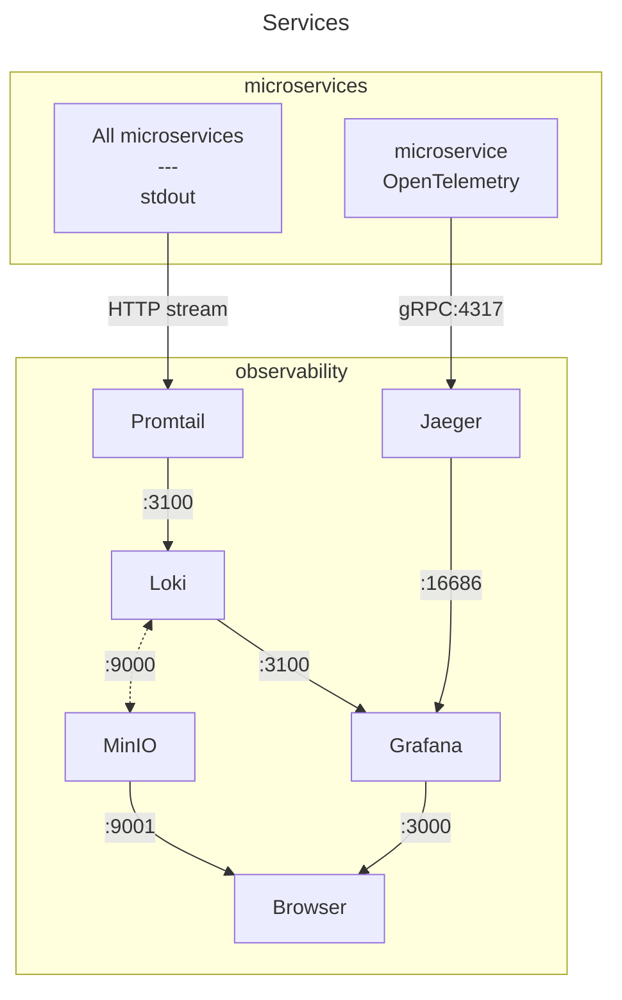
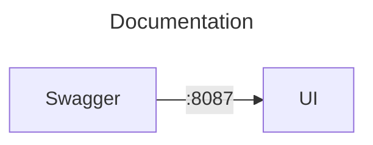
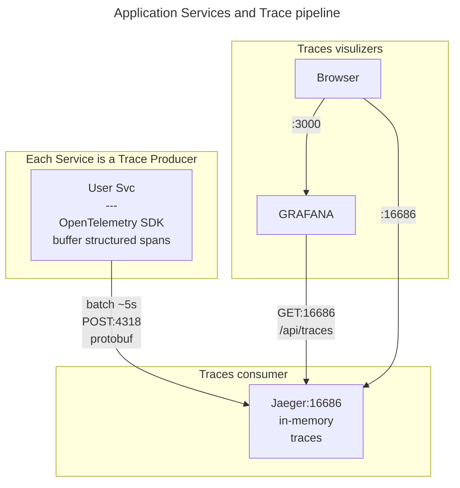

# Discover Microservices with Elixir with Observability

This is a demo of **Phoenix-Elixir-based microservices** demonstrating PNG-to-PDF image conversion with email notifications.

The idea of this demo is to give an introduction of differents technics:

- an OpenAPI design first,
- use protocol buffers contracts between services over HTTP/1.1,
- instrumentation with OpenTelemetry to collect the three observables, namely logs, traces and metrics.

We use quite a few technologies:

- Protocol buffers (the Elixir `:protobuf` library) for inter-service communication serialization with a compiled package-like installation
- background job processing (`Oban`) backed with the database `SQLite`
- `Swoosh` for email delivery
- `ExCmd` to stream `ImageMagick`
- `MinIO` for S3 compatible local-cloud storage
- `OpenTelemetry` with `Jaeger` and `Tempo` for traces (the later uses`MinIO` for back storage)
- `Promtail` with `Loki` linked to `MinIO` for logs
- `Prometheus` for metrics
- `Grafana` for global dashboards and `PromEx` for helping to setup `Grafana` dashboards

It is designed [API-first ➡ Code] as this aappears to be the best way to build APIs.

You used OpenAPI which includes _schemas_ which expose the protocol buffer contracts.

The proto contracts provide strong type safety. They are rather easy to design (_as long as you don't use the full gRPC methods and transport protocol_) and enforces the contract-first approach.

Routes follow a `Twirp`-like RPC DSL, with a format `/service_name/method_name` instead of traditional REST (`/resource`).

The main interest of this demo is to display a broad range of tools and orchestrate the observability tools with OpenTelemetry in `Elixir`.

## Prerequisites

This project uses **containers** heavily.

Ensure you have the following installed on your system:

- **Protocol Buffers Compiler** (`protoc`) - [Installation guide](https://grpc.io/docs/protoc-installation/)
- **ImageMagick** - Required for PNG/JPEG to PDF conversion

The **Docker setup**:

- You can setup the `watch` in _docker-compose.yml_ to trigger rebuilds on code change:

```yml
develop:
      watch:
        - action: rebuild
          path: ./apps/client_svc/lib
        - action: rebuild
          path: ./apps/client_svc/mix.exs
```

and run the _watch_ mode:

```sh
docker compose up --watch
```

- Execute Elixir commands on the _client_service_ container:

```sh
docker exec -it msvc-client-svc bin/client_svc remote

# Interactive Elixir (1.19.2) - press Ctrl+C to exit (type h() ENTER for help)

# iex(client_svc@ba41c71bacac)1> ImageClient.convert_png("my-image.png", "me@com")
```

## Protobuf

Why `protobuf`?

- **Type Safety**: Defines a contract on the data being exchanged
- **Efficiency**: Better compression and serialization speed compared to JSON
- **Simple API**: Mainly 2 methods: `encode` and `decode`

The messages are exchanged in _binary_ form, as opposed to standard plain JSON text, but the decoded messages are in JSON form!

The main reason of using this format is for _type safety_; the proto files clearly _document_ the contract between services.
It is not for speed (favor `messagepack`) nor for lowering message size (as opposed to JSON text).

**proto versioning**: create unique qualified names

You can namespace the package, like `package mcsv.v1`, and this will give a message versioned identifier like `Mcsv.V1.EmailRequest`.

**Example protobuf schema** (`email.proto`):

```proto
syntax = "proto3";
package mcsv.v1;

message EmailRequest {
  string user_id = 1;
  string user_name = 2;
  string user_email = 3;
  string email_type = 4;  // "welcome", "notification"...
  map<string, string> variables = 5;  // Template variables
}

message EmailResponse {
  bool success = 1;
  string message = 2;
  string email_id = 3; 
  int64 timestamp = 4;
}
```

### Protobuf in Practice: Encode/Decode Pattern

We use a **Twirp-like RPC DSL** instead of traditional REST. The routes are named after the service method (e.g., `/email_svc/SendEmail`) rather than REST resources (e.g., `/emails`).

**Example** ([email_svc/lib/router.ex:15](email_svc/lib/router.ex#L15)):

```elixir
post "/email_svc/send_email" do
  DeliveryController.send(conn)
end
```

**Decode Request** ([email_svc/lib/delivery_controller.ex:10-14](email_svc/lib/delivery_controller.ex#L10-L14)):

```elixir
def send(conn) do
  {:ok, binary_body, conn} = Plug.Conn.read_body(conn)

  # Decode protobuf binary → Elixir struct with pattern matching + versioning
  %Mcsv.V1.EmailRequest{
    user_name: name,
    user_email: email,
    email_type: type
  } = Mcsv.V1.EmailRequest.decode(binary_body)

  # Process the request...
end
```

**Encode Response** ([email_svc/lib/delivery_controller.ex:34-43](email_svc/lib/delivery_controller.ex#L34-L43)):

```elixir
# Build response struct and encode to binary
response_binary =
  %Mcsv.V1.EmailResponse{
    success: true,
    message: "Welcome email sent to #{email}"
  }
  |> Mcsv.V1.EmailResponse.encode()

# Send binary response with protobuf content type
conn
|> put_resp_content_type("application/protobuf")
|> send_resp(200, response_binary)
```

**Allow protobuf content through Plug.Parser**: allow protobuf to pass through

```elixir
plug(Plug.Parsers,
    parsers: [:json],
    json_decoder: Jason,
    # !! Skip parsing protobuf
    >>> pass: ["application/protobuf", "application/x-protobuf"]
  )
```

> TLDR:
> Setup the `:pass` in Plug.Parser in the _router.ex_
> **Decode**: `binary_body |> Mcsv.EmailRequest.decode()` → Elixir struct
> **Encode**: `%Mcsv.EmailResponse{...} |> Mcsv.EmailResponse.encode()` → binary
> **Content-Type**: Always `application/protobuf` for both request and response
> **Pattern Matching**: Decode directly into pattern-matched variables for clean code
> **RPC-Style Routes**: `/service_name/MethodName` (Twirp convention) instead of REST `/resources`

### Transport

When you use protobuf to serialize your messages, you are almost ready to use `gRPC` modulo the "rpc's" implementation.

However, we use **HTTP/1** because `gRPC` brings overhead and even latency when compared to HTTP for small to medium projects (check <https://www.youtube.com/watch?v=uH0SxYdsjv4>).

This means each app runs:

- A webserver: **Bandit** (HTTP server)
- An HTTP client: **Req** (HTTP client)

Communication pattern:

- HTTP POST with `Content-Type: application/protobuf`
- Binary protobuf encoding/decoding
- Synchronous request-response + async job processing

### Centralized Proto Compilation

This project uses a **centralized proto library** (`libs/protos`) that automatically compiles `.proto` definitions and distributes them as a Mix dependency. No manual `protoc` commands or file copying needed.

**Prerequisites**:

- `protoc` compiler installed ([installation guide](https://grpc.io/docs/protoc-installation/))
- For local development: `mix escript.install hex protobuf` (adds `protoc-gen-elixir` to PATH)

**How it works**:

In the folder _libs/protos_, we have the list of our proto files, `*.proto`.
We run a task to compile them in place to produce `*.pb.ex` files.

The files will be embeded into the Beam code just like any package, thus available.

```elixir
# libs/protos/mix.exs
def project do
  [
    compilers: Mix.compilers() ++ [:proto_compiler],
    proto_compiler: [
      source_dir: "proto_defs/#{protos_version()}",
      output_dir: "lib/protos/#{protos_version()}"
    ]
  ]
end

 defp protos_version, do: "V2"

defp deps do
  [
    {:protobuf, "~> 0.15.0"}
  ]
end

def Mix.Tasks.Compile.ProtoComiler do
  [...]
  System.cmd("protoc", args)
  [...]
end
```

In the services, declare the "package":

```elixir
# apps/client_svc/mix.exs
defp deps do
  [
    {:protos, path: "../../libs/protos"},  # Just add dependency
    {:protobuf, "~> 0.15.0"}
  ]
end
```

**version update**: you need to clean the build to pickup the new version

- You create a new subfolder, say _libs/protos/proto_defs/v10_,
- You update the version in the MixProject, under _protos_version_
- You run the following command:

```sh
mix deps.clean protos --build  && mix deps.get && mix compile --force
```

**Container implementation** (applies to all service Dockerfiles):

You need to bring in `protobuf-dev`, copy the _libs/proto_ folder, run the install script, define the PATH (as described in the [Elixir protobuf documentation](https://github.com/elixir-protobuf/protobuf#generate-elixir-code))

```dockerfile
# 1. Install protoc system package
RUN apk add --no-cache protobuf-dev

# 2. Copy shared protos library
COPY libs/protos libs/protos/

# 3. Install Mix dependencies (triggers proto compilation)
RUN mix deps.get --only prod

# 4. Install protoc-gen-elixir plugin and add to PATH
RUN mix escript.install --force hex protobuf
ENV PATH="/root/.mix/escripts:${PATH}"

# 5. Compile (protos already compiled as dependency)
RUN mix compile
```

**Key points**:

1. **Single source of truth**: The `.proto` files live in `libs/protos/proto_defs/`
2. **Custom Mix compiler**: Automatically compiles protos during `mix deps.get`
3. **Path dependency**: Services include `{:protos, path: "../../libs/protos"}` in mix.exs
4. **No manual copying**: Compiled `*.pb.ex` files are generated once and reused
5. Build automation: No manual `protoc` commands
6. Container-ready: Works in both dev and Docker environments

You can have a higher or more robust level of integration; check the following [blog from Andrea Leopardi](https://andrealeopardi.com/posts/sharing-protobuf-schemas-across-services/) about sharing protobuf across services. The author present a higher level vision of sharing protobuf schemas: produce a hex package and rely on the Hex package and the CI pipeline.

[](https://andrealeopardi.com/posts/sharing-protobuf-schemas-across-services/)

## OpenAPI Documentation

You receive a ticket to implement an API. You start by defining the OpenAPISpecs.

The OpenAPI specs document the HTTP interface and schemas (contracts).

The protobuf contract will implement these specs.

The manual YAML specs are:

- [client_svc.ymal](https://github.com/ndrean/micro_ex/blob/main/)openapi/client_svc.yaml) -- Client entrypoint (port 8085)
- [user_svc.yaml]([https://github.com/ndrean/micro_ex/blob/main/)openapi/user_svc.yaml) - User Gateway service (port 8081)
- [job_svc.yaml](https://github.com/ndrean/micro_ex/blob/main/openapi/job_svc.yaml) - Oban job queue service (port 8082)  
- [email_svc.yaml](https://github.com/ndrean/micro_ex/blob/main/openapi/email_svc.yaml) - Email delivery service (port 8083)
- [image_svc.yaml](https://github.com/ndrean/micro_ex/blob/main/openapi/image_svc.yaml) - Image processing service (port 8084)

We expose the documentation via a `SwaggerUI` container (port 8087).

The container has a bind mount to the _/open_api_ folder.

An example:


## Services Overview



### Client service

- **Purpose**: External client interface for testing
- **Key Features**:
  - triggers User creation with concurrent streaming
  - triggers PNG conversion of PNG images
  - Receives final workflow callbacks

### User service

- **Purpose**: Entry Gateway for user operations and workflow orchestration
- **Key Features**:
  - User creation and email job dispatch
  - Image conversion workflow orchestration
  - Image storage with presigned URLs
  - Completion callback relay to clients

### Job service

- **Purpose**: Background job processing orchestrator
- **Key Features**:
  - Oban-based job queue (SQLite database)
  - Email worker for welcome emails
  - Image conversion worker
  - Job retry logic and monitoring

### Email service

- **Purpose**: Email delivery service
- **Key Features**:
  - Swoosh email delivery
  - Email templates (welcome, notification, conversion complete)
  - Delivery callbacks

### Image service

- **Purpose**: Image conversion  service
- **Key Features**:
  - PNG>PDF conversion using ImageMagick
  - S3 storage of converted image

### Workflow example: Email Notification

This workflow demonstrates async email notifications using Oban and Swoosh.



**Key Features**:

- Concurrent request handling via `Task.async_stream`
- Async processing after job enqueue
- Oban retry logic for failed emails
- Callback chain for status tracking

Example of trace propagation via telemetry of the email flow:


### Workflow Example: PNG to PDF Conversion (Pull Model)

This workflow demonstrates efficient binary data handling using the "Pull Model" or "Presigned URL Pattern" (similar to AWS S3). Instead of passing large image binaries through the service chain, only metadata and URLs are transmitted.

- **Pull Model & Presigned URLs**: Image service fetches data on-demand via temporary URLs (using AWS S3 pattern)



Example of trace propagation via telemetry of the image flow:


## Observability

Now that we have our workflows, we want to add observability.

Firtly a quote:

> "Logs, metrics, and traces are often known as the three pillars of observability. While plainly having access to logs, metrics, and traces doesn’t necessarily make systems more observable, these are powerful tools that, if understood well, can unlock the ability to build better systems."

We will only scratch the surface of observability.



### Stack Overview

The big picture:





The tools pictured above are designed to be used in a **container** context.

| System     | Purpose                | Description                                                                                                                                                                                                                                    |
| ---------- | ---------------------- | ---------------------------------------------------------------------------------------------------------------------------------------------------------------------------------------------------------------------------------------------- |
| Prometheus | Metrics scrapper       | "How much CPU/memory/time?                                                                                                    "What's my p95 latency?" "How many requests per second?" "Is memory usage growing?" "Which endpoint is slowest?" |
| Loki       | Logs scrapper          | Centralized logs from all services "Show me all errors in the last hour" "What did user X do?" "Find logs containing 'timeout'" "What happened before the crash?"                                                                              |
| Jaeger     | Traces collection      | Full journey accross services "Which service is slow in this request?" "How does a request flow through services?" "Where did this request fail?" "What's the call graph?"                                                                     |
| Grafana    | Reporting & Dashboards | Global view of the system                                                                                                                                                                                                                      |

How does this work?


| System            | Model                                       | Format                 | Storage                                        |
| ----------------- | ------------------------------------------- | ---------------------- | ---------------------------------------------- |
| Prometheus        | PULL (scrape)                               | Plain text             | Disk (TimeSerieDB)                             |
|                   | GET /metrics Every 15s                      | key=value              | prometheus-data                                |
| Loki via Promtail | PUSH  Batched                               | JSON (logs) structured | MinIO (S3) loki-chunks                         |
| Jaeger (or Tempo) | PUSH OTLP                                   | Protobuf (spans)   │   | - Jaeger: memory only <br> - Tempo: S3 storage |
| Grafana           | UI only, connected to Loki / Jaeger / Tempo | -                      | SQLite   (dashboards only)                     |

### Trace pipeline

In dev mode, `Jaeger` offers a UI frontend (whilst not `Tempo`). 

A view the services seen by Jaeger:




> If you run  locally with Docker, you can use the Docker daemon and use a `loki` driver to read and push the logs from stdout (in the docker socket) to Loki.

> We used instead `Promtail` to consume the logs and push them to Loki. This solution is more K8 ready.

> To use a local `loki` driver, we need to isntall it:

```sh
docker plugin install grafana/loki-docker-driver:latest --alias loki --grant-all-permissions
```

## OpenTelemetry

### Setup

We use `Phoenix` and `Req`.

**dependencies**: a bunch to add (`PromEx` is for Grafana dashboards for collect Beam metrics and more generally Prometheus metrics in a custom designed dashboard)

```elixir
{:opentelemetry_exporter, "~> 1.10"},
{:opentelemetry_api, "~> 1.5"},
{:opentelemetry_ecto, "~> 1.2"},
{:opentelemetry, "~> 1.7"},
{:opentelemetry_phoenix, "~> 2.0"},
{:opentelemetry_bandit, "~> 0.3.0"},
{:opentelemetry_req, "~> 1.0"},
{:tls_certificate_check, "~> 1.29"},

# Prometheus metrics
{:prom_ex, "~> 1.11.0"},
{:telemetry_metrics_prometheus_core, "~> 1.2"},
{:telemetry_poller, "~> 1.3"},
```

In _endpoint.ex_, check that you have:

```elixir
# Request ID for distributed tracing correlation
plug(Plug.RequestId)

# Phoenix telemetry (emits events for OpenTelemetry)
plug(Plug.Telemetry, event_prefix: [:phoenix, :endpoint])
```

In the macro injector module (_my_app_web.ex_), add `OpenTelemetry.Tracer` so that it is present in each controller.

```elixir
def controller do
  quote do
    use Phoenix.Controller, formats: [:json]

    import Plug.Conn
    require OpenTelemetry.Tracer, as: Tracer
  end
end
```

In _telemetry.ex_, your `init` callback looks like:

```elixir
def init(_arg) do
  Logger.info("[ClientService.Telemetry] Setting up OpenTelemetry instrumentation")

  children = [
    # Telemetry poller for VM metrics (CPU, memory, etc.)
    {:telemetry_poller, measurements: periodic_measurements(), period: 10_000}
  ]

  :ok = setup_opentelemetry_handlers()

  Supervisor.init(children, strategy: :one_for_one)
end

defp setup_opentelemetry_handlers do
  # 1. Phoenix automatic instrumentation
  # Creates spans for every HTTP request with route, method, status
  :ok = OpentelemetryPhoenix.setup(adapter: :bandit)

  # 2. Bandit HTTP server instrumentation 
  :ok = OpentelemetryBandit.setup(opt_in_attrs: [])
end
```

### Propagation traces with Req

Use `OpentelemetryReq.attach(propagate_trace_headers: true)` as [explained in OpenTelemetry_Req](https://hexdocs.pm/opentelemetry_req/OpentelemetryReq.html#module-trace-header-propagation) and as shown below:

```elixir
defp post(%Mcsv.V2.UserRequest{} = user, base, uri) do
  binary = Mcsv.V2.UserRequest.encode(user)

  Req.new(base_url: base)
  |> OpentelemetryReq.attach(propagate_trace_headers: true)
  |> Req.post(
    url: uri,
    body: binary,
    headers: [{"content-type", "application/protobuf"}]
  )
end
```

### Start a trace

The _trace context_ is automatically propagated.

When we use `with_span`, we get the _parent-child_ relationship.

- you get the current active span from the context
- Sets the new span as a child of that span
- Restores the previous span when done

> `Baggage` is when you need metadata available in all downstream spans (userID,...). We don't use this here.

```elixir
require OpenTelemetry.Tracer, as: Tracer
require OpenTelemetry.Span, as: Span

def function_to_span(...) do
  Tracer.with_span "#{__MODULE__}.create/1" do
    Tracer.set_attribute(:value, i)
    ok
  end
  [...]
```

If you use an _async_ call, you _must_ propagate it with  `Ctx.get_current()`, and `Ctx.attach(ctx)`:

```elixir
ctx = OpenTelemetry.Ctx.get_current()

Task.async(fn ->
  OpenTelemetry.Ctx.attach(ctx)
  ImageMagick.get_image_info(image_binary)
end)
```

## COCOMO Complexity Analysis of this project

Curious? ⏯️ <https://en.wikipedia.org/wiki/COCOMO>

Implementation: <https://github.com/boyter/scc>

> The OpenAPISpecs are "just" YAML but take even more time than Protocol Buffers files to write, but take 0 complexity!?

| Language        | Files | Lines  | Blanks | Comments | Code   | Complexity |
| --------------- | ----- | ------ | ------ | -------- | ------ | ---------- |
| Elixir          | 130   | 8,271  | 1,212  | 1,170    | 5,889  | 300        |
| YAML            | 13    | 2,148  | 160    | 76       | 1,912  | 0          |
| JSON            | 10    | 14,847 | 6      | 0        | 14,841 | 0          |
| Markdown        | 10    | 2,293  | 551    | 0        | 1,742  | 0          |
| Docker ignore   | 6     | 209    | 48     | 54       | 107    | 0          |
| Dockerfile      | 5     | 453    | 112    | 114      | 227    | 17         |
| Protocol Buffe… | 5     | 251    | 45     | 25       | 181    | 0          |
| HTML            | 1     | 412    | 33     | 0        | 379    | 0          |
| Makefile        | 1     | 77     | 11     | 11       | 55     | 4          |
| Shell           | 1     | 41     | 7      | 6        | 28     | 0          |
| Total           | 182   | 29,002 | 2,185  | 1,456    | 25,361 | 321        |

Estimated Cost to Develop (organic) $805,322

Estimated Schedule Effort (organic) 12.67 months

Estimated People Required (organic) 5.65

## Production Considerations

**Observability scales horizontally, not per-service**:

- Prometheus scrapes 5 or 500 services equally well
- 1oki aggregates logs from 5 or 5000 pods
- Jaeger traces 5 or 50 microservices

**Background Jobs & ImageService**: the Image service is CPU intensive, so you can use a loadbalancer between the Job Service and the Image(s) services. Then Oban cannot scale so RabbitMQ to distribute over all consumers.

**Production Optimization**:

- Use managed services (Datadog, New Relic, Grafana Cloud) to eliminate self-hosting
- Sidecar pattern (Promtail as DaemonSet in K8s) reduces per-pod overhead
- **Sampling strategies** for traces (10% of traffic vs 100% in dev)
- **Protocol optimization**:
  - **Current**: OTLP/HTTP (port 4318) - Easy to debug, reliable
  - **Production**: Switch to OTLP/gRPC (port 4317) - 2-5x faster, HTTP/2 multiplexing
  - **Metrics**: Consider StatsD/UDP (fire-and-forget, non-blocking) for high-volume metrics
  - **How to switch to gRPC**:
  
      ```bash
      # Option 1: Environment variables (recommended)
      OTEL_EXPORTER_OTLP_PROTOCOL=grpc
      OTEL_EXPORTER_OTLP_ENDPOINT=http://jaeger:4317
      
      # Option 2: .env file (copy from .env.example)
      echo "OTEL_PROTOCOL=grpc" >> .env
      echo "OTEL_ENDPOINT=http://jaeger:4317" >> .env
      docker compose up --build
      ```

  - **Note**: Requires `otlp_protocol` config update (already implemented in `user_svc`, replicate for other services)
  - **Why not UDP for traces?** Traces are critical for debugging; losing spans = incomplete request flows

## TODOS?

- Observability Enhancements

  - **Add custom PromEx plugins** for business metrics:
    - Image conversion success rate
    - Email delivery latency
    - Job queue depth by worker type

  - **Alerting rules**:
    - Prometheus AlertManager for threshold-based alerts
    - Integrate with PagerDuty/Slack

  - **Log sampling** for production:
    - Sample 10% of successful requests
    - Keep 100% of errors/warnings

### Possible architecture Improvements

- **Service mesh** (Istio/Linkerd):
  - Automatic mTLS between services
  - Circuit breaking and retries
  - Traffic splitting for canary deployments

- **Event sourcing** for job_svc:
  - Replace Oban state transitions with event sourcing: RabbitMQ
  - Better audit trail and replay capability
  - See explanation below ⬇️

## Tests

1. **Static Analysis** (100% - every file save):
   - Credo, Dialyzer, ExDoc

2. **Unit Tests** (70% of test suite):
   - Test individual functions in isolation
   - Fast (<1ms per test), no external dependencies
   - Example: Test `ImageSvc.convert_to_pdf/2` with mock files

3. **Integration Tests** (20% of test suite):
   - Test multiple modules working together
   - May use real database (SQLite in your case)
   - Example: Test Oban job enqueuing → worker execution → email delivery

Connect to the "msvc-client-svc" container and get an IEX session to run commands:

```sh
docker exec -it msvc-client-svc bin/client_svc remote

iex(client_svc@b6d94600b7e3)4> 
   Enum.to_list(1..1000) 
   |> Task.async_stream(fn i -> Client.create(i) end, max_concurrency: 10, ordered: false) 
   |> Stream.run


iex(client_svc@b6d94600b7e3)5>
   List.duplicate("lib/client_svc-0.1.0/priv/test.png", 100) 
   |> Task.async_stream(
         fn file -> ImageClient.convert_png(file, "m@com") 
      end)
   |> Stream.run()

iex(client_svc@b6d94600b7e3)6> Stream.interval(100) |>Stream.take(1200) |> Task.async_stream(fn i -> ImageClient.convert_png("lib/client_svc-0.1.0/priv/test.png", "m#{i}@com") end, max_concurrenccy: 10, orderede: false) |> Stream.run()
# :ok
```

4. **Contract Tests** (Service boundaries):
   - Verify Protobuf message compatibility between services
   - Tools: **Pact** (consumer-driven contracts)
   - Example: `user_svc` expects `job_svc` to accept `EmailRequest` with fields `user_id`, `user_email`

5. **End-to-End (E2E) Tests** (5% of test suite):
   - Full workflow across all services
   - Slow, brittle, but catches integration bugs
   - Example: Upload PNG → verify PDF in MinIO → check email sent

6. **Load/Performance Tests** (On-demand):
   - Tools: **K6**, **Locust**, **wrk**
   - Measure throughput, latency percentiles (p50, p95, p99)
   - Example: Can the system handle 1000 concurrent image conversions?

```elixir
t = 100

Stream.interval(t) 
|> Stream.take(1200)
|> Task.async_stream(fn
  i -> ImageClient.convert_png("my_image.png", "m#(i}@com") end, 
  ordered: false, 
  max_concurrency: 10
) |> Stream.run()
```

## Misc tips & tricks

The usage of RPC-style endpoints (not RESTful API with dynamic segments) makes observability easier (no `:id` in static paths).

Prometheus via `:promex`. We named "prometheus" the datasource name in the onfiguration file _prometheus.yml_  under the key `:uid`.

```sh
mix prom_ex.gen.config --datasource prometheus

mix prom_ex.dashboard.export --dashboard application.json --module UserSvc.PromEx --file_path ../../grafana/dashboards/user_svc_application.json

for service in job_svc image_svc email_svc client_svc; do
  cd apps/$service
  mix prom_ex.dashboard.export --dashboard application.json --module "$(echo $service | sed 's/_\([a-z]\)/\U\1/g' | sed 's/^./\U&/').PromEx" --stdout > ../../grafana/dashboards/${service}_application.json
  mix prom_ex.dashboard.export --dashboard beam.json --module "$(echo $service | sed 's/_\([a-z]\)/\U\1/g' | sed 's/^./\U&/').PromEx" --stdout > ../../grafana/dashboards/${service}_beam.json
  cd ../..
done
```

- protobuf: set `pass: ["application/protobuf"]` in the Plug.Parsers in the module _router.ex_ .
- follow trace async/Oban worker: add "_otel_trace_context" to your Oban job args
- PromEx datasource: use the value in datasource.name (and uid) for /grafana/provisioning/datasources/datasources.yml, and in /prom_ex.ex/ dashboard_assigns()[:datasource]
- generate the standard Promex dshboards.
- respect Grafana folder structure: _grafana/provisioning/{datasources,dashboards,plugins,notifiers}_.

Testing ImageMagick in container: create a PNG image 100x100 filled with red and pipe into te command.

```sh
docker exec msvc-image-svc sh -c 'magick -size 100x100 xc:red png:- | magick png:- -limit thread 10 -quality 95 -density 300 pdf:- 2>&1 | head -c 100'
```

## Source

<https://www.curiosum.com/blog/grafana-and-promex-with-phoenix-app>

<https://dockyard.com/blog/2023/09/12/building-your-own-prometheus-metrics-with-promex>

<https://dockyard.com/blog/2023/10/03/building-your-own-prometheus-metrics-with-promex-part-2>

<https://hexdocs.pm/prom_ex/telemetry.html>