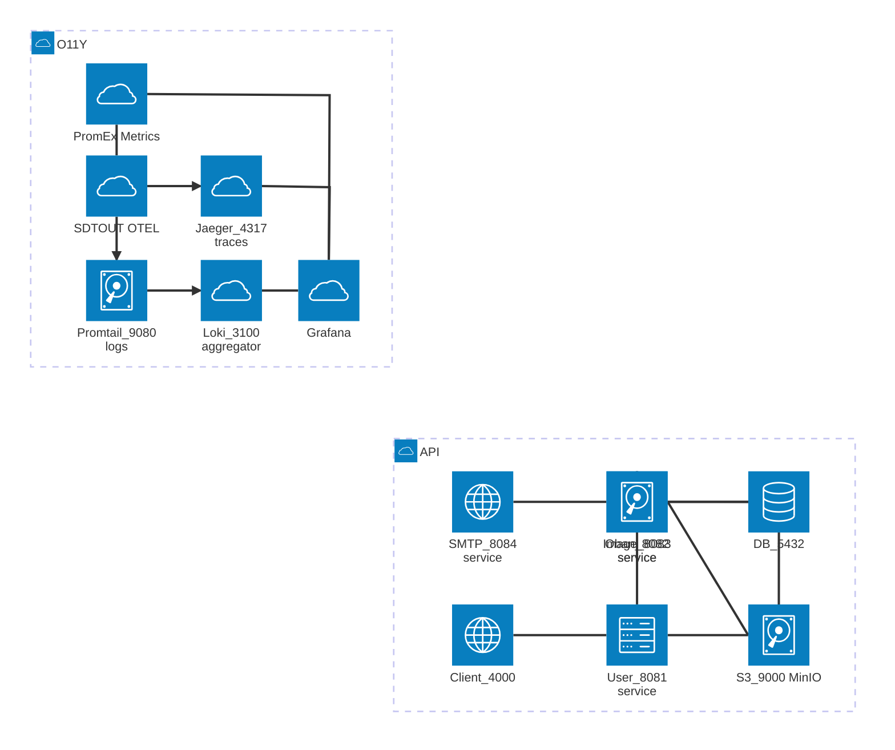
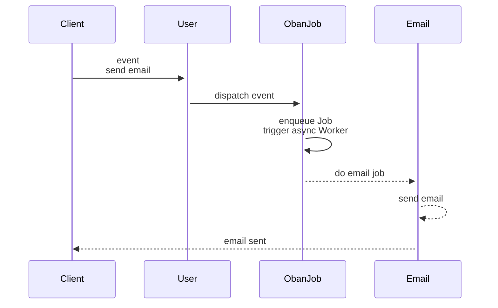
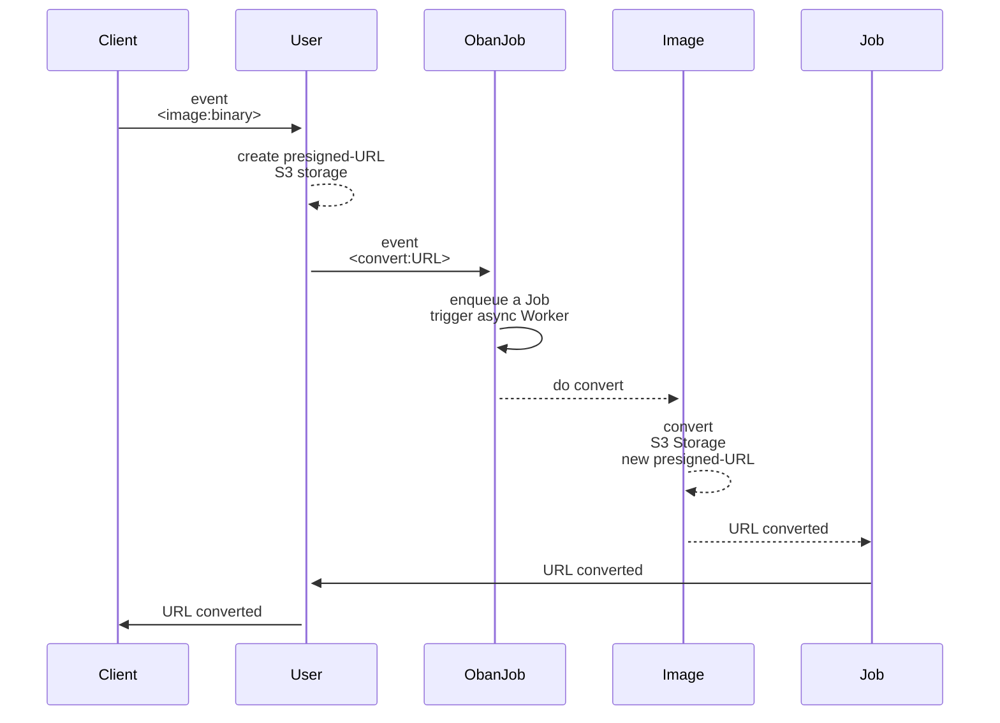
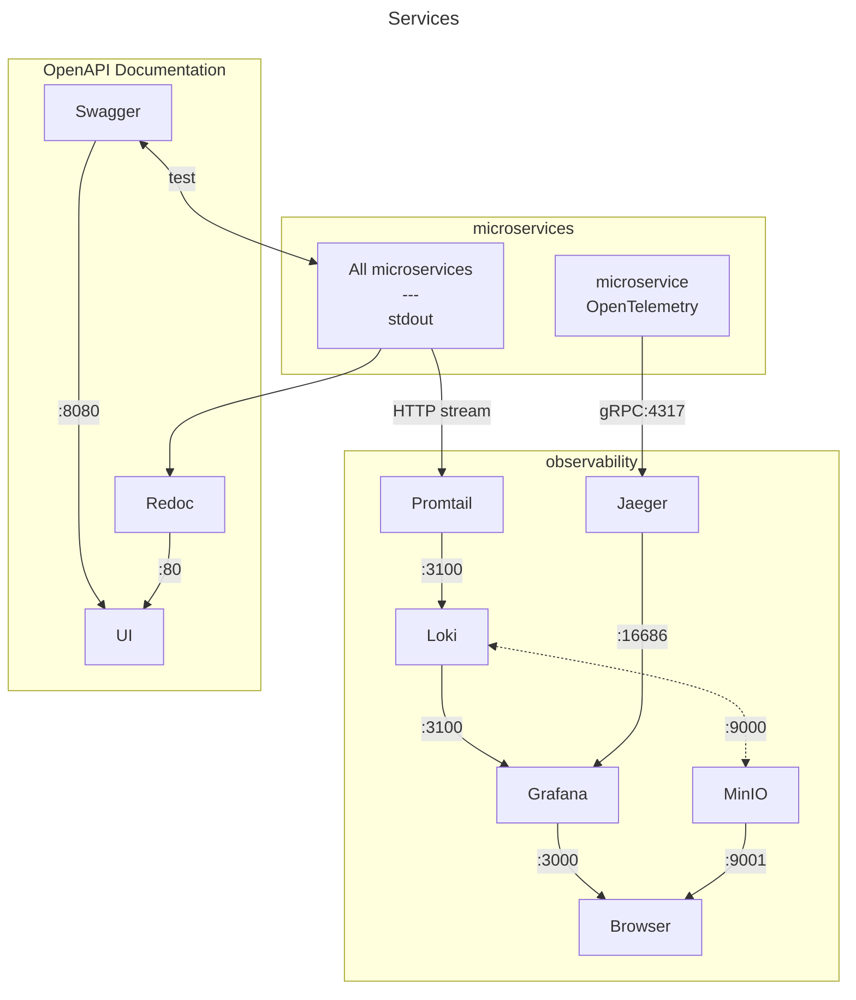
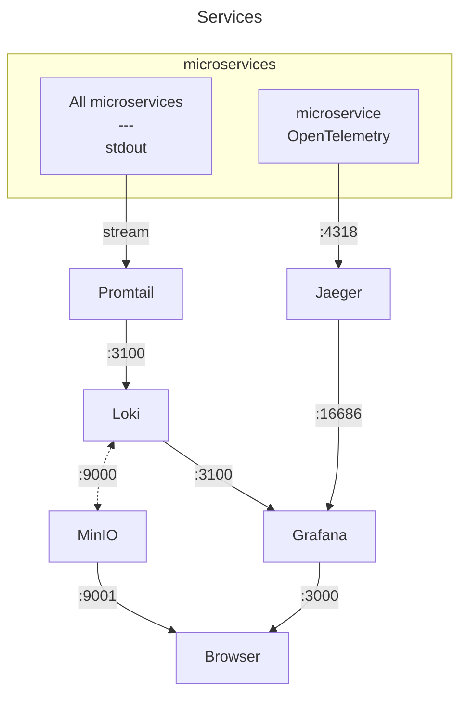
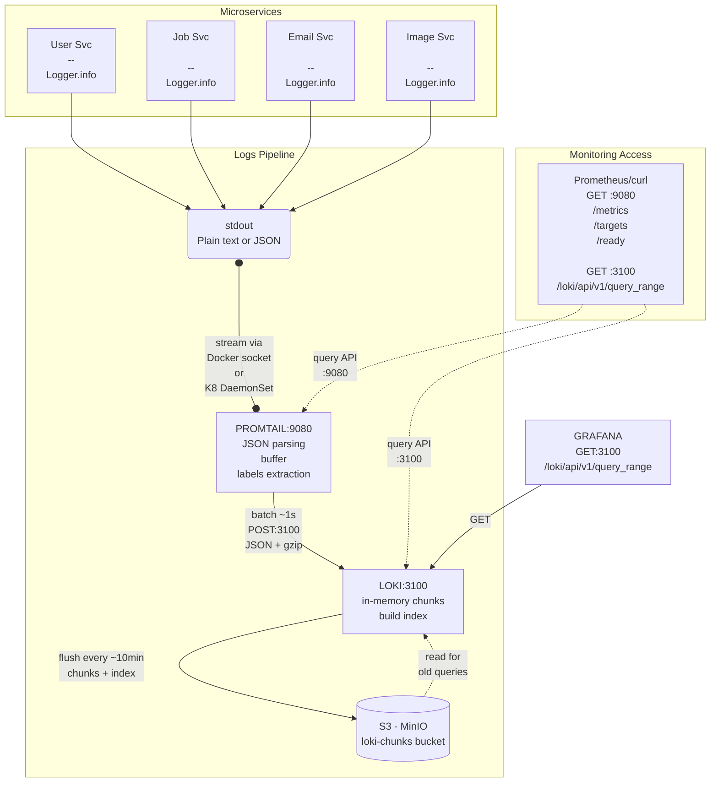
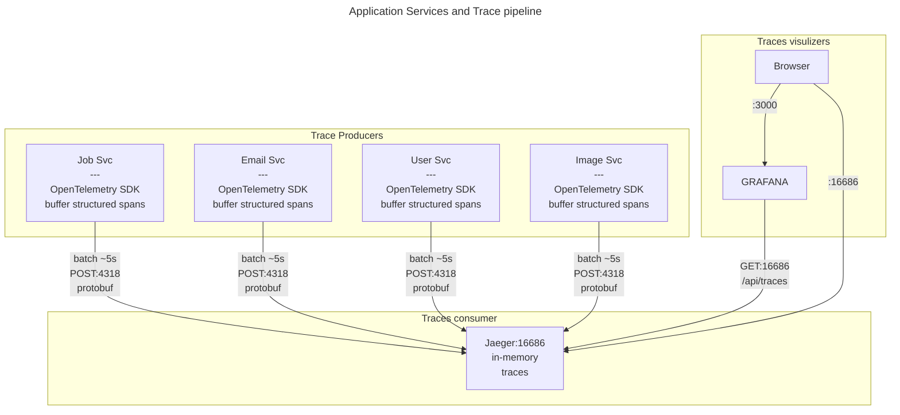

# Discover Microservices with Elixir with Observability

This is a tiny demo of **Phoenix/Elixir-based microservices** demonstrating PNG-to-PDF image conversion with email notifications.

The idea of this demo is to use:

- an OpenAPI design first,
- use protocol buffers contracts between services over HTTP/1.1,
- instrument with OpenTelemetry to collect the three observables, namely logs, traces and metrics.

The system still uses quite a few technologies.

- Protocol buffers for inter-service communication serialization with a compiled package-like installation
- `Oban` for background job processing backed with the database `SQLite`
- `Swoosh` for email delivery
- `ImageMagick` for image conversion
- `MinIO` for S3 compatible local-cloud storage
- `OpenTelemetry` with `Jaeger` and `Tempo` for traces (the later uses`MinIO` for back storage)
- `Promtail` with `Loki` linked to `MinIO` for logs
- `Prometheus` for metrics
- `Grafana` for global dashboards and `PromEx` for helping to setup `Grafana` dashboards


It is designed [API-first ➡ Code] as this is the easiest way to build contracts between services and design the proto files accordingly.

In turn, the proto contracts provides strong type safety. They are rather easy to design (_as long as you don't use the full gRPC methods and transport protocol_) and enforces the contract-first approach.

Routes follow a `Twirp`-like RPC DSL, with a format `/service_name/method_name` instead of traditional REST (`/resource`).

The main interest of this demo is the orchestration of all the observability tools with OpenTelemetry in `Elixir`.

## Services Overview



### Client service

- **Purpose**: External client interface for testing
- **Key Features**:
  - triggers User creation with concurrent streaming
  - triggers PNG conversion of PNG images
  - Receives final workflow callbacks

### User service

- **Purpose**: Entry Gateway for user operations and workflow orchestration
- **Key Features**:
  - User creation and email job dispatch
  - Image conversion workflow orchestration
  - Image storage with presigned URLs
  - Completion callback relay to clients

### Job service

- **Purpose**: Background job processing orchestrator
- **Key Features**:
  - Oban-based job queue (SQLite database)
  - Email worker for welcome emails
  - Image conversion worker
  - Job retry logic and monitoring

### Email service

- **Purpose**: Email delivery service
- **Key Features**:
  - Swoosh email delivery
  - Email templates (welcome, notification, conversion complete)
  - Delivery callbacks

### Image service

- **Purpose**: Image conversion  service
- **Key Features**:
  - PNG>PDF conversion using ImageMagick
  - S3 storage of converted image

### Workflow example: Email Notification

This workflow demonstrates async email notifications using Oban and Swoosh.



**Key Features**:

- Concurrent request handling via `Task.async_stream`
- Async processing after job enqueue
- Oban retry logic for failed emails
- Callback chain for status tracking

### Workflow Example: PNG to PDF Conversion (Pull Model)

This workflow demonstrates efficient binary data handling using the "Pull Model" or "Presigned URL Pattern" (similar to AWS S3). Instead of passing large image binaries through the service chain, only metadata and URLs are transmitted.

- **Pull Model & Presigned URLs**: Image service fetches data on-demand via temporary URLs (using AWS S3 pattern)



### API Design and Documentation

You receive a ticket to implement an API.
You start by defining the OpenAPISpecs.

### OpenAPI Specifications

All services provide OpenAPI 3.0 specifications for their HTTP endpoints.

While the services communicate internally via **Protobuf binary serialization** (`application/x-protobuf`), the OpenAPI specs document the HTTP interface and contract.
The protobuf contract will implement these specs.

The manual YAML specs are:

- 📘 **[user_svc.yaml](openapi/user_svc.yaml)** - User orchestration service (port 8081)
- 📗 **[job_svc.yaml](openapi/job_svc.yaml)** - Oban job queue service (port 8082)  
- 📙 **[email_svc.yaml](openapi/email_svc.yaml)** - Email delivery service (port 8083)
- 📕 **[image_svc.yaml](openapi/image_svc.yaml)** - Image processing service (port 8084)

### OpenApiSpex Implementation

You have the option to enforce runtime checks. The **OpenApiSpex** runtime spec generation is documented for one service only, `image_svc`.

The type safety of the protobuf serialization covers and the integration tests cover however most of the endpoints.

| Service    | OpenApiSpex Runtime | Manual YAML |
| ---------- | :-----------------: | :---------: |
| client_svc |        ❌ No         |    ✅ Yes    |
| user_svc   |        ❌ No         |    ✅ Yes    |
| job_svc    |        ❌ No         |    ✅ Yes    |
| image_svc  |        ✅ Yes        |    ✅ Yes    |
| email_svc  |        ❌ No         |    ✅ Yes    |

**image_svc Implementation** (reference example):

```elixir
# lib/api_spec.ex - OpenAPI spec definition
defmodule ImageSvc.ApiSpec do
  alias OpenApiSpex.{Info, OpenApi, Server}
  
  def spec do
    %OpenApi{
      info: %Info{
        title: "Image Service API",
        version: "1.0.0"
      },
      servers: [%Server{url: "http://localhost:8084"}],
      paths: Paths.from_router(ImageSvc.Router)
    }
  end
end

# lib/router.ex - Serve spec at /openapi
plug(OpenApiSpex.Plug.PutApiSpec, module: ImageSvc.ApiSpec)

get "/openapi" do
  conn
  |> put_resp_content_type("application/json")
  |> send_resp(200, Jason.encode!(ImageSvc.ApiSpec.spec()))
end

# lib/conversion_controller.ex - Document endpoint
use OpenApiSpex.ControllerSpecs

operation :convert,
  summary: "Convert image to PDF",
  request_body: {"Image conversion request", "application/x-protobuf", ImageConversionRequestSchema},
  responses: [
    ok: {"Conversion successful", "application/x-protobuf", ImageConversionResponseSchema}
  ]
```

See [openapi/README.md](openapi/README.md) for detailed documentation setup and usage.

### Viewing Documentation

We used `Swagger` on port 8087 and `Redoc` on port 8086 to generate online documentation of the APIs.

Both are running in containers.

We have a bind mount to the _/open_api_ folder.

**Swagger UI Service Selector**:

```txt
http://localhost:8085
├── User Service (8081)    ← Dropdown selector
├── Job Service (8082)
├── Email Service (8083)
└── Image Service (8084)
```

**Redoc Direct Links** (specify YAML via query param):

```txt
http://localhost:8080?url=specs/user_svc.yaml
http://localhost:8080?url=specs/job_svc.yaml
http://localhost:8080?url=specs/email_svc.yaml
http://localhost:8080?url=specs/image_svc.yaml
```

## Observability O11Y

Now that we have our workflows, we want to add observability.

Firtly a quote:

> "Logs, metrics, and traces are often known as the three pillars of observability. While plainly having access to logs, metrics, and traces doesn’t necessarily make systems more observable, these are powerful tools that, if understood well, can unlock the ability to build better systems."

We will only scratch the surface of observability.

### Stack Overview

The big picture:



The tools pictured above are designed to be used in a **container** context.

| System     | Purpose                |
| ---------- | ---------------------- |
| Prometheus | Metrics scrapper       |
| Loki       | Logs scrapper          |
| Jaeger     | Traces collection      |
| Grafana    | Reporting & Dashboards |

Some explanations about **who does what?**:

- METRICS: `Prometheus`
  "How much CPU/memory/time?
  "What's my p95 latency?"
  "How many requests per second?"
  "Is memory usage growing?"
  "Which endpoint is slowest?"

- LOGS: `Loki`
  Centralized logs from all services
  "Show me all errors in the last hour"
  "What did user X do?"
  "Find logs containing 'timeout'"
  "What happened before the crash?"

- TRACING: `Jaeger`
  Full journey accross services
  "Which service is slow in this request?"
  "How does a request flow through services?"
  "Where did this request fail?"
  "What's the call graph?"

| System            | Model                  | Format                 | Storage                      |
| ----------------- | ---------------------- | ---------------------- | ---------------------------- |
| Prometheus        | PULL (scrape)          | Plain text             | Disk (TS-DB)                 |
|                   | GET /metrics Every 15s | key=value              | prometheus-data              |
| Loki via Promtail | PUSH  Batched          | JSON (logs) structured | MinIO (S3) loki-chunks       |
| Jaeger            | PUSH OTLP              | Protobuf (spans)   │   | Memory only! Lost on restart |
| Grafana           | N/A (UI)               | N/A                    | SQLite   (dashboards only)   |

### Observables flow between Services


<details>
<summary>Containers</summary>



</details>

### Logs pipeline


<details>
<summary>Logs pipeline</summary>



</details>

### Trace pipeline


<details>
<summary>CTrace pipeline</summary>



</details>

If you run  locally with Docker, you can use the Docker daemon and use a `loki` driver to read and push the logs from stdout (in the docker socket) to Loki. We used instead `Promtail` to consume the logs and push them to Loki. This solution is more K8 ready.

> To use a local `loki` driver, we need to isntall it:

```sh
docker plugin install grafana/loki-docker-driver:latest --alias loki --grant-all-permissions
```

## Prerequisites

This project uses **containers** heavily.

Ensure you have the following installed on your system:

- **Protocol Buffers Compiler** (`protoc`) - [Installation guide](https://grpc.io/docs/protoc-installation/)
- **ImageMagick** - Required for PNG/JPEG to PDF conversion

  ```bash
  # macOS
  brew install imagemagick

  # Ubuntu/Debian
  sudo apt-get install imagemagick

  # Verify installation
  magick --version
  ```

- **SQLite3** - For Oban job queue (usually pre-installed on most systems)

A **Quick Setup**

```sh
# 1. Start MinIO (S3-compatible storage)
./setup_minio.sh

# 2. Test MinIO connection
elixir test_storage_simple.exs

# 3. Install dependencies for each service
cd user_svc && mix deps.get
cd ../job_svc && mix deps.get
# ... repeat for other services

# 4. Generate protobuf files from /protos (single source of truth)
# Note: protoc creates the protos/ subdirectory automatically
for svc in user_svc job_svc email_svc image_svc client_svc; do
  protoc --elixir_out=./$svc/lib/ --proto_path=. protos/*.proto
done
```

See [MINIO_SETUP.md](MINIO_SETUP.md) for detailed MinIO configuration and troubleshooting.

The **Docker setup**:

- Setup the `watch` in _docker-compose.yml_ (rebuilds on code change)

```yml
develop:
      watch:
        - action: rebuild
          path: ./apps/client_svc/lib
        - action: rebuild
          path: ./apps/client_svc/mix.exs
```

- Run the _watch_ mode:

```sh
docker compose up --watch
```

- Execute Elixir commands on the _client_service_ container:

```sh
docker exec -it msvc-client-svc bin/client_svc remote

# Interactive Elixir (1.19.2) - press Ctrl+C to exit (type h() ENTER for help)
# iex(client_svc@ba41c71bacac)1> ImageClient.convert_png("my-image.png", "me@com")
```

## Protobuf

The messages are exchanged in _binary_ form, as opposed to standard plain JSON text.

Why `protobuf`?

- **Type Safety**: Defines a contract on the data being exchanged
- **Efficiency**: Better compression and serialization speed compared to JSON
- **Simple API**: Mainly 2 methods: `encode` and `decode`
- **Human Readable**: Decoded messages are human readable for debugging

The main reason of using this format is for _type safety_ here, not for speed (favor `messagepack`) nor for lowering message size (as opposed to JSON text).

The proto files clearly _document_ the contract between services.

**Example protobuf schema** (`email.proto`):

```proto
syntax = "proto3";
package mcsv;

message EmailRequest {
  string user_id = 1;
  string user_name = 2;
  string user_email = 3;
  string email_type = 4;  // "welcome", "notification"...
  map<string, string> variables = 5;  // Template variables
}

message EmailResponse {
  bool success = 1;
  string message = 2;
  string email_id = 3; 
  int64 timestamp = 4;
}
```

### Protobuf in Practice: Encode/Decode Pattern

We use a **Twirp-like RPC DSL** instead of traditional REST.

Routes are named after the service method (e.g., `/email_svc/SendEmail`) rather than REST resources (e.g., `/emails`).

**Router Setup** ([email_svc/lib/router.ex:15](email_svc/lib/router.ex#L15)):

```elixir
post "/email_svc/SendEmail" do
  DeliveryController.send(conn)
end
```

**Decode Request** ([email_svc/lib/delivery_controller.ex:10-14](email_svc/lib/delivery_controller.ex#L10-L14)):

```elixir
def send(conn) do
  {:ok, binary_body, conn} = Plug.Conn.read_body(conn)

  # Decode protobuf binary → Elixir struct with pattern matching
  %Mcsv.EmailRequest{
    user_name: name,
    user_email: email,
    email_type: type
  } = Mcsv.EmailRequest.decode(binary_body)

  # Process the request...
end
```

**Encode Response** ([email_svc/lib/delivery_controller.ex:34-43](email_svc/lib/delivery_controller.ex#L34-L43)):

```elixir
# Build response struct and encode to binary
response_binary =
  %Mcsv.EmailResponse{
    success: true,
    message: "Welcome email sent to #{email}"
  }
  |> Mcsv.EmailResponse.encode()

# Send binary response with protobuf content type
conn
|> put_resp_content_type("application/protobuf")
|> send_resp(200, response_binary)
```

### Allow protobuf content through Plug.Parser

```elixir
plug(Plug.Parsers,
    parsers: [:json],
    json_decoder: Jason,
    # !! Skip parsing protobuf
    >>> pass: ["application/protobuf", "application/x-protobuf"]
  )
```

### Key Points

- Setup the `:pass` in Plug.Parser in the _router.ex_
- **Decode**: `binary_body |> Mcsv.EmailRequest.decode()` → Elixir struct
- **Encode**: `%Mcsv.EmailResponse{...} |> Mcsv.EmailResponse.encode()` → binary
- **Content-Type**: Always `application/protobuf` for both request and response
- **Pattern Matching**: Decode directly into pattern-matched variables for clean code
- **RPC-Style Routes**: `/service_name/MethodName` (Twirp convention) instead of REST `/resources`

### Transport

When you use protobuf to serialize your messages, you are almost ready to use `gRPC` modulo the "rpc's" implementation.

However, we use **HTTP/1** because `gRPC` brings overhead and even latency when compared to HTTP for small to medium projects (check <https://www.youtube.com/watch?v=uH0SxYdsjv4>).

This means each app runs:

- A webserver: **Bandit** (HTTP server)
- An HTTP client: **Req** (HTTP client)

Communication pattern:

- HTTP POST with `Content-Type: application/protobuf`
- Binary protobuf encoding/decoding
- Synchronous request-response + async job processing

### Centralized Proto Compilation

This project uses a **centralized proto library** (`libs/protos`) that automatically compiles `.proto` definitions and distributes them as a Mix dependency. No manual `protoc` commands or file copying needed.

**Prerequisites**:

- `protoc` compiler installed ([installation guide](https://grpc.io/docs/protoc-installation/))
- For local development: `mix escript.install hex protobuf` (adds `protoc-gen-elixir` to PATH)

**Proto File Distribution**:

- `user.proto` → user_svc, job_svc, image_svc, client_svc
- `image.proto` → user_svc, job_svc, image_svc, client_svc
- `email.proto` → job_svc, email_svc
- `job.proto` → job_svc

**Design Pattern**:

1. **Single source of truth**: All `.proto` files live in `libs/protos/proto_defs/`
2. **Custom Mix compiler**: Automatically compiles protos during `mix deps.get`
3. **Path dependency**: Services include `{:protos, path: "../../libs/protos"}` in mix.exs
4. **No manual copying**: Compiled `*.pb.ex` files are generated once and reused

**How it works**:

```elixir
# libs/protos/mix.exs
def project do
  [
    compilers: Mix.compilers() ++ [:proto_compiler],
    proto_compiler: [
      source_dir: "proto_defs",
      output_dir: "lib/protos"
    ]
  ]
end

# apps/client_svc/mix.exs
defp deps do
  [
    {:protos, path: "../../libs/protos"},  # Just add dependency
    {:protobuf, "~> 0.15.0"}
  ]
end
```

**Container implementation** (applies to all service Dockerfiles):

```dockerfile
# 1. Install protoc system package
RUN apk add --no-cache protobuf-dev

# 2. Copy shared protos library
COPY libs/protos libs/protos/

# 3. Install Mix dependencies (triggers proto compilation)
RUN mix deps.get --only prod

# 4. Install protoc-gen-elixir plugin and add to PATH
RUN mix escript.install --force hex protobuf
ENV PATH="/root/.mix/escripts:${PATH}"

# 5. Compile (protos already compiled as dependency)
RUN mix compile
```

**Benefits**:

- DRY: Update `.proto` files in one place
- Type safety: All services use identical message definitions
- Build automation: No manual `protoc` commands
- Container-ready: Works in both dev and Docker environments

## OpenTelemetry

### Spans

How to setup spans to get traces.

```elixir
require OpenTelemetry.Tracer, as: Tracer
require OpenTelemetry.Span, as: Span

def function_to_span(...) do
  Tracer.with_span "#{__MODULE__}.create/1" do
    Tracer.set_attribute(:value, i)
    ok
  end
  [...]
```

- Propagate spans
  

[TODO]

`:otel_propagator_text_map.inject`:

```elixir
# Inject OpenTelemetry trace context into job args
    trace_headers = :otel_propagator_text_map.inject([])
    trace_context = Map.new(trace_headers)
```

- add `:opentelemetry_req`
- use `OpentelemetryReq.attach(propagate_trace_headers: true)`

```elixir
Req.post(
   Req.new(base_url: base)
    |> OpentelemetryReq.attach(propagate_trace_headers: true),
     url: path,
     body: body,
      headers: [{"content-type", "application/protobuf"}],
      receive_timeout: receive_timeout
) 
```

## [TODO] Move this somewhere! Misc tips & tricks

The usage of RPC-style endpoints (not RESTful API with dynamic segments) makes observability easier (no `:id` in static paths).

Tracing: headers are injected to follow the trace: `_otel_trace_context`

Prometheus via `:promex`. We named "prometheus" the datasource name in the onfiguration file _prometheus.yml_  under the key `:uid`.

```sh
mix prom_ex.gen.config --datasource prometheus

mix prom_ex.dashboard.export --dashboard application.json --module UserSvc.PromEx --file_path ../../grafana/dashboards/user_svc_application.json

for service in job_svc image_svc email_svc client_svc; do
  cd apps/$service
  mix prom_ex.dashboard.export --dashboard application.json --module "$(echo $service | sed 's/_\([a-z]\)/\U\1/g' | sed 's/^./\U&/').PromEx" --stdout > ../../grafana/dashboards/${service}_application.json
  mix prom_ex.dashboard.export --dashboard beam.json --module "$(echo $service | sed 's/_\([a-z]\)/\U\1/g' | sed 's/^./\U&/').PromEx" --stdout > ../../grafana/dashboards/${service}_beam.json
  cd ../..
done
```

- protobuf: set `pass: ["application/protobuf"]` in the Plug.Parsers in the module _router.ex_ .
- follow trace async/Oban worker: add "_otel_trace_context" to your Oban job args
- PromEx datasource: use the value in datasource.name (and uid) for /grafana/provisioning/datasources/datasources.yml, and in /prom_ex.ex/ dashboard_assigns()[:datasource]
- generate the standard Promex dshboards.
- respect Grafana folder structure: _grafana/provisioning/{datasources,dashboards,plugins,notifiers}_.

## Testing

- unit tests
- contract tests
- integration tests
- load tests
- chaos tests
  
Connect to the "msvc-client-svc" container and get an IEX session to run commands:

```sh
docker exec -it msvc-client-svc bin/client_svc remote

iex(client_svc@b6d94600b7e3)4> 
   Enum.to_list(1..1000) 
   |> Task.async_stream(fn i -> Client.create(i) end, max_concurrency: 10, ordered: false) 
   |> Stream.run


iex(client_svc@b6d94600b7e3)5>
   List.duplicate("lib/client_svc-0.1.0/priv/test.png", 100) 
   |> Task.async_stream(
         fn file -> ImageClient.convert_png(file, "m@com") 
      end)
   |> Stream.run()

iex(client_svc@b6d94600b7e3)6> Stream.interate(50) |> Task.async_stream(fn _ -> Client.create(1) end, max_concurrenccy: 10, orderede: false) |> Stream.run()
# :ok
```


## COCOMO Complexity Analysis of this project

Tool: <https://github.com/boyter/scc>

───────────────────────────────────────────────────────────────────────────────
Language            Files       Lines    Blanks  Comments       Code Complexity
───────────────────────────────────────────────────────────────────────────────
Elixir                103       7,097     1,066       901      5,130        267
JSON                   10      14,875         7         0     14,868          0
YAML                   10       1,386       104        78      1,204          0
Markdown                8       1,177       302         0        875          0
Docker ignore           5         204        47        54        103          0
Dockerfile              5         345        86        92        167         16
Protocol Buffe…         5         310        50        86        174          0
Shell                   3         128        23        17         88          3
HTML                    1         412        33         0        379          0
───────────────────────────────────────────────────────────────────────────────
Total                 150      25,934     1,718     1,228     22,988        286
───────────────────────────────────────────────────────────────────────────────
Estimated Cost to Develop (organic) $726,392
Estimated Schedule Effort (organic) 12.18 months
Estimated People Required (organic) 5.30
───────────────────────────────────────────────────────────────────────────────
Processed 683366 bytes, 0.683 megabytes (SI)
───────────────────────────────────────────────────────────────────────────────

## Production Considerations

### Container Count Breakdown

**Application Containers** (5+):

- client_svc, user_svc, job_svc, email_svc, image_svc

**Infrastructure** (1-2):

- Storage: MinIO (S3-compatible storage)
- RDBMS (embeded serverless SQLite here, but Postgres server in production)

**Observability** (6):

- Prometheus (metrics scraper + TSDB)
- Loki (log aggregator)
- Promtail (log shipper - would be K8s DaemonSet in prod)
- Jaeger (trace collector)
- Grafana (visualization UI)
- Swagger UI / Redoc (API documentation viewers)

**Total**: 12 containers (in production, observability would serve 100s of services)

---

**Observability scales horizontally, not per-service**:

- Prometheus scrapes 5 or 500 services equally well
- 1oki aggregates logs from 5 or 5000 pods
- Jaeger traces 5 or 50 microservices

1. **Cost in production**:

```txt
5 Elixir apps × 512MB = 2.5GB
Observability stack    = 2GB (Prometheus/Loki data stores)
Total                  = 4.5GB

50 Elixir apps × 512MB = 25GB
Observability stack    = 3GB (same containers, more data)
Total                  = 28GB (~10% overhead)
```

**Production Optimization**:

- Use managed services (Datadog, New Relic, Grafana Cloud) to eliminate self-hosting
- Sidecar pattern (Promtail as DaemonSet in K8s) reduces per-pod overhead
- **Sampling strategies** for traces (10% of traffic vs 100% in dev)
- **Protocol optimization**:
  - **Current**: OTLP/HTTP (port 4318) - Easy to debug, reliable
  - **Production**: Switch to OTLP/gRPC (port 4317) - 2-5x faster, HTTP/2 multiplexing
  - **Metrics**: Consider StatsD/UDP (fire-and-forget, non-blocking) for high-volume metrics
  - **How to switch to gRPC**:
  
      ```bash
      # Option 1: Environment variables (recommended)
      OTEL_EXPORTER_OTLP_PROTOCOL=grpc
      OTEL_EXPORTER_OTLP_ENDPOINT=http://jaeger:4317
      
      # Option 2: .env file (copy from .env.example)
      echo "OTEL_PROTOCOL=grpc" >> .env
      echo "OTEL_ENDPOINT=http://jaeger:4317" >> .env
      docker compose up --build
      ```

  - **Note**: Requires `otlp_protocol` config update (already implemented in `user_svc`, replicate for other services)
  - **Why not UDP for traces?** Traces are critical for debugging; losing spans = incomplete request flows

## TODOS

- **Implement OpenApiSpex for all services**?

- **Auto-generate OpenAPI YAML from specs**:
  
```elixir
# Add to each service router
get "/openapi.yaml" do
   spec = MyService.ApiSpec.spec()
   yaml = OpenApiSpex.OpenApi.to_yaml(spec)
   send_resp(conn, 200, yaml)
end
```

- **Replace manual YAML with runtime-generated specs**:
  - Fetch from `/openapi.yaml` endpoint instead of static files
  - Single source of truth (code = documentation)

- Observability Enhancements

  - **Add custom PromEx plugins** for business metrics:
    - Image conversion success rate
    - Email delivery latency
    - Job queue depth by worker type

  - **Alerting rules**:
    - Prometheus AlertManager for threshold-based alerts
    - Integrate with PagerDuty/Slack

  - **Log sampling** for production:
    - Sample 10% of successful requests
    - Keep 100% of errors/warnings

### Architecture Improvements

- **OTLP protocol configuration** for all services:
  - `user_svc` - Runtime protocol selection implemented
  - `job_svc`, `image_svc`, `email_svc`, `client_svc` - Copy pattern from user_svc

- **Service mesh** (Istio/Linkerd):
  - Automatic mTLS between services
  - Circuit breaking and retries
  - Traffic splitting for canary deployments

- **Event sourcing** for job_svc:
  - Replace Oban state transitions with event log
  - Better audit trail and replay capability
  - See explanation below ⬇️

## Tests

1. **Static Analysis** (100% - every file save):
   - Credo, Dialyzer, ExDoc

2. **Unit Tests** (70% of test suite):
   - Test individual functions in isolation
   - Fast (<1ms per test), no external dependencies
   - Example: Test `ImageSvc.convert_to_pdf/2` with mock files

3. **Integration Tests** (20% of test suite):
   - Test multiple modules working together
   - May use real database (SQLite in your case)
   - Example: Test Oban job enqueuing → worker execution → email delivery

4. **Contract Tests** (Service boundaries):
   - Verify Protobuf message compatibility between services
   - Tools: **Pact** (consumer-driven contracts)
   - Example: `user_svc` expects `job_svc` to accept `EmailRequest` with fields `user_id`, `user_email`

5. **End-to-End (E2E) Tests** (5% of test suite):
   - Full workflow across all services
   - Slow, brittle, but catches integration bugs
   - Example: Upload PNG → verify PDF in MinIO → check email sent

6. **Load/Performance Tests** (On-demand):
   - Tools: **K6**, **Locust**, **wrk**
   - Measure throughput, latency percentiles (p50, p95, p99)
   - Example: Can the system handle 1000 concurrent image conversions?

7. **Chaos Engineering** (Production-like environments):
   - **What it is**: Deliberately inject failures to verify resilience
   - **Tools**: Chaos Mesh, Gremlin, Toxiproxy
   - **Examples**:
     - Kill random containers (test retry logic)
     - Inject network latency (test timeouts)
     - Fill disk to 100% (test error handling)
     - Corrupt Protobuf messages (test validation)
   - **Goal**: Discover weaknesses before they cause outages

## Event Sourcing vs Oban (Architectural Pattern)

Oban is a State-based Jo queue.
Event Sourcing can be considered if the following questions arise:

- "Why did this job fail 3 times before succeeding?"
- "Replay all image conversions that failed due to MinIO timeout"
- "Show me jobs cancelled by user X in the last 30 days"

### Current: Oban (State-Based Job Queue)

```elixir
# Oban stores CURRENT STATE in SQLite
jobs table:
id | state      | worker           | args
1  | completed  | EmailWorker      | %{user_id: 123}
2  | executing  | ImageWorker      | %{job_id: 456}
3  | failed     | ImageWorker      | %{job_id: 789}

# You know WHERE the job is NOW, but not HOW it got there
# Lost information: retries, who cancelled, why it failed, etc.
```

**Pros**:

- Simple to understand and use
- Built-in retry logic
- Low storage overhead (one row per job)
- Fast queries (index on `state`)

**Cons**:

- No audit trail (can't answer "who cancelled this job?")
- Can't replay history (can't reprocess from step 2)
- Hard to debug (lost intermediate states)

---

### Alternative: Event Sourcing

```elixir
# Instead of storing CURRENT state, store ALL EVENTS
events table:
id | job_id | event_type        | data                      | timestamp
1  | 456    | job_created       | %{user_id: 123}           | 2025-11-05 10:00:00
2  | 456    | job_enqueued      | %{queue: "default"}       | 2025-11-05 10:00:01
3  | 456    | job_started       | %{worker_pid: #PID<...>}  | 2025-11-05 10:00:05
4  | 456    | conversion_failed | %{error: "timeout"}       | 2025-11-05 10:01:00
5  | 456    | job_retried       | %{attempt: 2}             | 2025-11-05 10:02:00
6  | 456    | job_completed     | %{pdf_url: "s3://..."}    | 2025-11-05 10:02:30

# Current state = reduce(events)
# State at any time = reduce(events up to timestamp)
```

**Pros**:

- Complete audit trail: "Who did what, when, and why?"
- Time travel: Replay events to see state at any point
- Debuggability: See exact sequence of events leading to failure
- Event-driven architecture: Other services can subscribe to events
- Analytics: Answer business questions ("How many jobs fail on first attempt?")

**Cons**:

- Complexity: More code to write (event handlers, reducers)
- Storage overhead: 10x more rows (one per event vs one per job)
- Query complexity: Must reduce events to get current state
- Learning curve: Requires mental shift from CRUD to events

---

### Example: Job Retry with Event Sourcing

```elixir
# Traditional Oban (state update)
def handle_failure(job) do
  # Lost info: what was the error? how many times retried?
  Oban.update(job, %{state: "failed", attempts: job.attempts + 1})
end

# Event Sourcing (append events)
def handle_failure(job, error) do
  EventStore.append([
    %JobEvent{type: :job_failed, job_id: job.id, data: %{
      error: error,
      attempt: job.attempts,
      worker_pid: self(),
      timestamp: DateTime.utc_now()
    }},
    %JobEvent{type: :job_retried, job_id: job.id, data: %{
      next_attempt_at: DateTime.add(DateTime.utc_now(), 60, :second),
      retry_reason: "automatic_retry_policy"
    }}
  ])
end

# "Show me all jobs that failed due to timeout on their 3rd attempt"
EventStore.query(
  event_type: :job_failed,
  data: %{error: "timeout", attempt: 3}
)
```

Testing ImageMagick in container: create a PNG image 100x100 filled with red and pipe into te command.

```sh
docker exec msvc-image-svc sh -c 'magick -size 100x100 xc:red png:- | magick png:- -limit thread 10 -quality 95 -density 300 pdf:- 2>&1 | head -c 100'
```