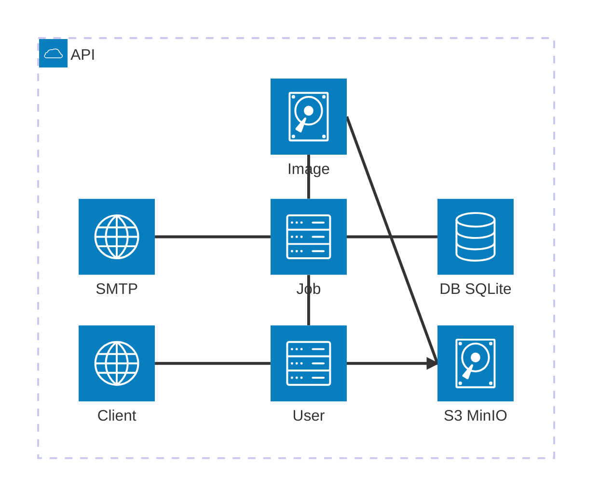
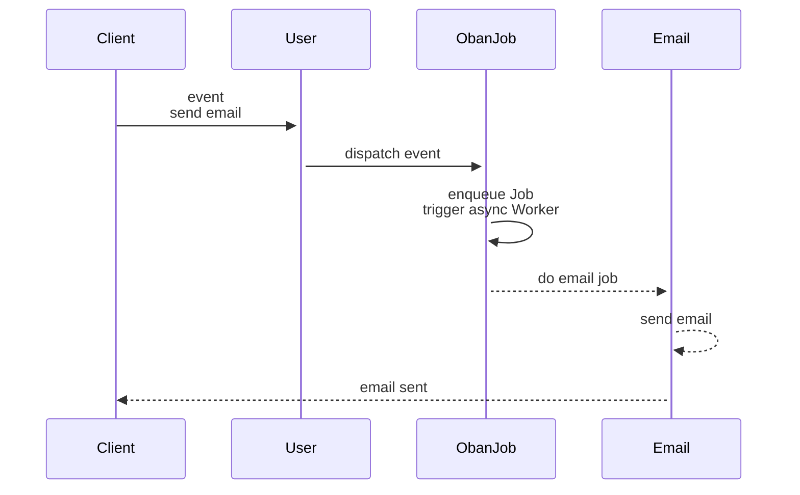
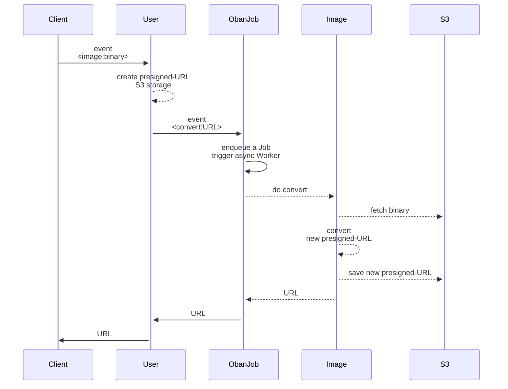
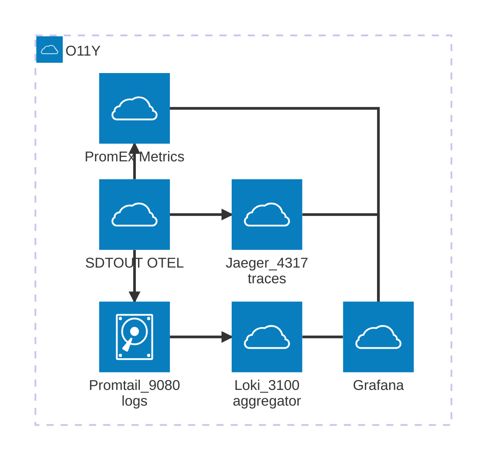
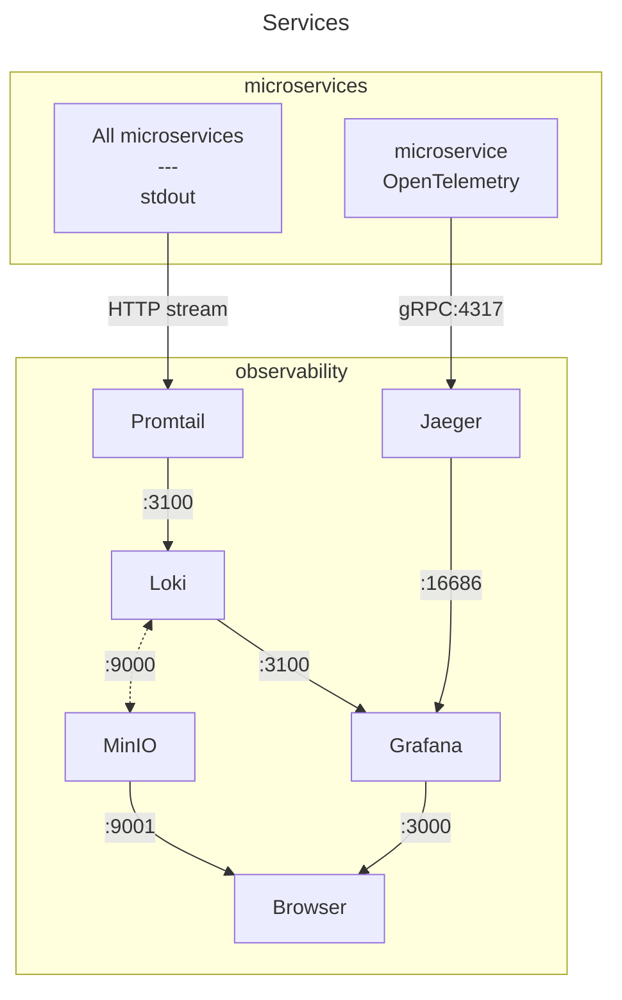
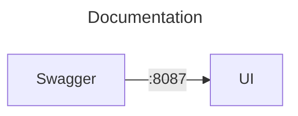
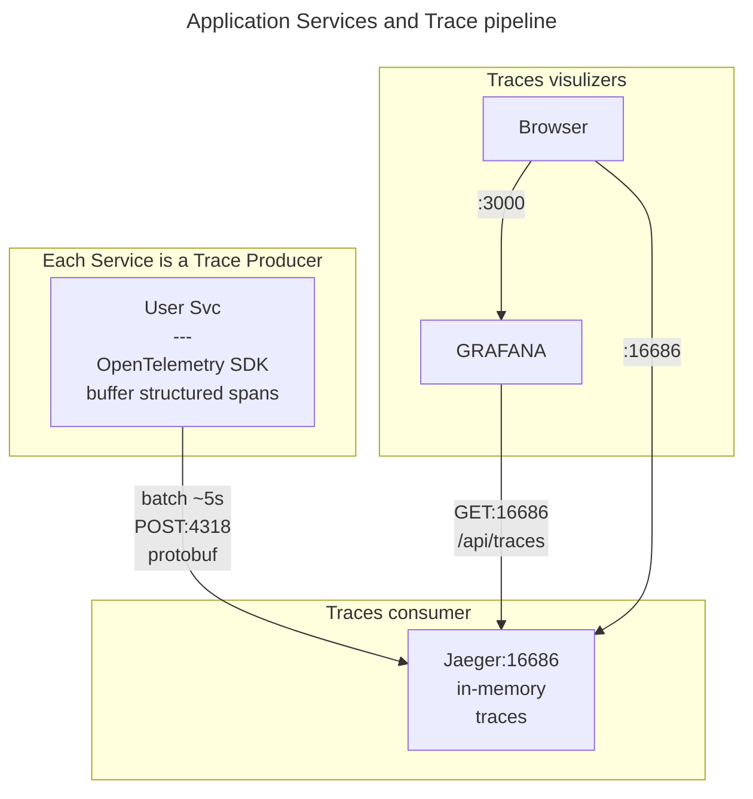

# Discover Microservices with Elixir with Observability

This a toy **Phoenix-Elixir-based microservices** app demonstrating PNG-to-PDF image conversion with email notifications.

It is complete enough to understand the concepts used but not production code.

It works on Docker as an API. The Elixir containers/services can be reached via _remote_  sessions and the observability services are reachable in the browser (port mapping in _.env.example_).

[TODO]

- build an interactive (T?)UI to run Elixir commands and reach easily all of the exposed services,
- deploy this example on Debian VPS (and change to Debian based images instead of Alpine)

## The Problem

**Goal**: We want to build a system that delivers high-volume PNG-to-PDF conversion with email notifications.

**Challenge**: Image conversion is CPU-intensive and can become a bottleneck. How do you know where the bottleneck is? How do you scale efficiently?

**Answer**: use a microservice architecture where **Observability is the key**.

Before you can optimize or scale, you need to see:

- Which step/service is slow? (traces)
- How much CPU/memory is consumed? (metrics)
- What errors occur and when? (logs)

This demo shows how to instrument a microservices system with OpenTelemetry to gain these insights, then discusses practical scaling strategies based on what you observe.

## What This Demo Covers

The main interest of this demo is to display a broad range of tools and orchestrate the observability tools with OpenTelemetry in `Elixir`.

It gives an introduction to different techniques:

- an [OpenAPI Design first](https://learn.openapis.org/best-practices.html) approach,
- protocol buffers contracts between services over HTTP/1.1,
- instrumentation with `OpenTelemetry` and PromEx to collect the three observables, logs, traces and metrics.

We use quite a few technologies:

- Protocol buffers (the Elixir `:protobuf` library) for inter-service communication serialization with a compiled package-like installation
- background job processing (`Oban`) backed with the database `SQLite`
- an email library (`Swoosh`)
- a process runner `ExCmd` to stream `ImageMagick`
- S3 compatible local-cloud storage `MinIO`
- `OpenTelemetry` with `Jaeger` and `Tempo` for traces (the latter uses `MinIO` for backing storage)
- `Promtail` with `Loki` linked to `MinIO` for logs
- `Prometheus` for metrics
- `Grafana` for global dashboards and `PromEx` to setup `Grafana` dashboards.

## Prerequisites

This project uses **containers** heavily.

Ensure you have the following installed on your system:

- Protocol Buffers Compiler (`protoc`) - [Installation guide](https://grpc.io/docs/protoc-installation/)
- `ImageMagick` and `Ghostscript` for PNG, JPEG -> PDF conversion

The **Docker setup**:

- You can setup the `watch` in _docker-compose.yml_ to trigger rebuilds on code change:

```yml
develop:
      watch:
        - action: rebuild
          path: ./apps/client_svc/lib
        - action: rebuild
          path: ./apps/client_svc/mix.exs
```

and run the _watch_ mode:

```sh
docker compose up --watch
```

You can execute Elixir commands on the _client_service_ container:

```sh
docker exec -it msvc-client-svc bin/client_svc remote

# Interactive Elixir (1.19.2) - press Ctrl+C to exit (type h() ENTER for help)

# iex(client_svc@ba41c71bacac)1> ImageClient.convert_png("my-image.png", "me@com")
```

## OpenAPI Documentation

### Design-First Workflow

When you receive a ticket to implement an API, **start by defining the OpenAPI specification**. This follows the **API-design-first** approach, which is considered best practice for building maintainable APIs.

**The workflow:**

```text
OpenAPI Design → Protobuf Implementation → Code
```

1. **Design Phase (OpenAPI)**: Define the HTTP API contract
   - **Endpoints**: Specify paths, HTTP methods, and parameters
   - **Schemas**: Define request/response body structures with validation rules
   - **Documentation**: Add descriptions, examples, and error responses

2. **Implementation Phase**: Translate the design into code
   - **Protobuf contracts**: Implement the schemas as `.proto` messages for type-safe serialization
   - **Endpoint handlers**: Build controllers that match the OpenAPI paths
   - **Validation**: Ensure implementation matches the spec

**Why this approach works:**

- **OpenAPI** is ideal for design: human-readable, stakeholder-friendly, HTTP-native (status codes, headers, content types)
- **Protobuf** is ideal for implementation: compile-time type safety, efficient binary serialization, language-agnostic
- Both represent the **same data structures** in different formats (JSON Schema vs binary wire format)

### API Style: Twirp-like RPC

> Routes follow a `Twirp`-like RPC DSL with the format `/service_name/method_name` instead of traditional REST (`/resource`).

This RPC-style simplifies observability (no dynamic path segments) and pairs naturally with protobuf's service/method semantics.

**Example** ([email_svc.yaml](openapi/email_svc.yaml)):

The OpenAPI schema defines the contract:

```yaml
paths:
  /email_svc/send_email/v1:
    post:
      requestBody:
        content:
          application/protobuf:
            schema:
              $ref: '#/components/schemas/EmailRequest'

components:
  schemas:
    EmailRequest:
      properties:
        user_id: string
        user_name: string
        user_email: string (format: email)
        email_type: string (enum: [welcome, notification])
```

Which is then implemented as a protobuf contract ([libs/protos/proto_defs/V1/email.proto](libs/protos/proto_defs/V1/email.proto)):

```proto
message EmailRequest {
  string user_id = 1;
  string user_name = 2;
  string user_email = 3;
  string email_type = 4;
  map<string, string> variables = 5;  // Additional fields for implementation
}
```

The best introduction is to read [the OpenAPI spec](https://learn.openapis.org/specification/) and explore the examples in the [/openapi](openapi) folder.

A view of an openapi spec YAML file (using the 42crunch extension):


The manual YAML specs are:

- [client_svc.yaml](https://github.com/ndrean/micro_ex/blob/main/openapi/client_svc.yaml) -- Client entrypoint (port 8085)
- [user_svc.yaml](https://github.com/ndrean/micro_ex/blob/main/openapi/user_svc.yaml) - User Gateway service (port 8081)
- [job_svc.yaml](https://github.com/ndrean/micro_ex/blob/main/openapi/job_svc.yaml) - Oban job queue service (port 8082)
- [email_svc.yaml](https://github.com/ndrean/micro_ex/blob/main/openapi/email_svc.yaml) - Email delivery service (port 8083)
- [image_svc.yaml](https://github.com/ndrean/micro_ex/blob/main/openapi/image_svc.yaml) - Image processing service (port 8084)

We expose the documentation via a `SwaggerUI` container (port 8087). The container has a bind mount to the _/open_api_ folder.

An example:


## Protobuf

Now that we've defined the HTTP API contracts with OpenAPI, let's see how the request/response schemas are implemented for efficient serialization between services.

Why `protobuf`?

- **Type Safety**: Defines a contract on the data being exchanged
- **Efficiency**: Better compression and serialization speed compared to JSON
- **Simple API**: Mainly 2 methods: `encode` and `decode`

The messages are exchanged in _binary_ form, as opposed to standard plain JSON text, but the decoded messages are in JSON form!

The main reason of using this format is for _type safety_; the proto files clearly _document_ the contract between services.
It is not for speed (favor `messagepack`) nor for lowering message size (as opposed to JSON text).

**proto versioning**: create unique qualified names

You can namespace the package, like `package mcsv.v1`, and this will give a message versioned identifier like `Mcsv.V1.EmailRequest`.

**Example protobuf schema** (`email.proto`):

```proto
syntax = "proto3";
package mcsv.v1;

message EmailRequest {
  string user_id = 1;
  string user_name = 2;
  string user_email = 3;
  string email_type = 4;  // "welcome", "notification"...
  map<string, string> variables = 5;  // Template variables
}

message EmailResponse {
  bool success = 1;
  string message = 2;
  string email_id = 3; 
  int64 timestamp = 4;
}
```

### Protobuf in Practice: Encode/Decode Pattern

We use a **Twirp-like RPC DSL** instead of traditional REST. The routes are named after the service method (e.g., `/email_svc/SendEmail`) rather than REST resources (e.g., `/emails`).

**Example** ([email_svc/lib/router.ex:15](email_svc/lib/router.ex#L15)):

```elixir
post "/email_svc/send_email" do
  DeliveryController.send(conn)
end
```

**Decode Request** ([email_svc/lib/delivery_controller.ex:10-14](email_svc/lib/delivery_controller.ex#L10-L14)):

```elixir
def send(conn) do
  {:ok, binary_body, conn} = Plug.Conn.read_body(conn)

  # Decode protobuf binary → Elixir struct with pattern matching + versioning
  %Mcsv.V1.EmailRequest{
    user_name: name,
    user_email: email,
    email_type: type
  } = Mcsv.V1.EmailRequest.decode(binary_body)

  # Process the request...
end
```

**Encode Response** ([email_svc/lib/delivery_controller.ex:34-43](email_svc/lib/delivery_controller.ex#L34-L43)):

```elixir
# Build response struct and encode to binary
response_binary =
  %Mcsv.V1.EmailResponse{
    success: true,
    message: "Welcome email sent to #{email}"
  }
  |> Mcsv.V1.EmailResponse.encode()

# Send binary response with protobuf content type
conn
|> put_resp_content_type("application/protobuf")
|> send_resp(200, response_binary)
```

**Allow protobuf content through Plug.Parser**: allow protobuf to pass through

```elixir
plug(Plug.Parsers,
    parsers: [:json],
    json_decoder: Jason,
    # !! Skip parsing protobuf
    >>> pass: ["application/protobuf", "application/x-protobuf"]
  )
```

> TLDR:
> Setup the `:pass` in Plug.Parser in the _router.ex_
> **Decode**: `binary_body |> Mcsv.EmailRequest.decode()` → Elixir struct
> **Encode**: `%Mcsv.EmailResponse{...} |> Mcsv.EmailResponse.encode()` → binary
> **Content-Type**: Always `application/protobuf` for both request and response
> **Pattern Matching**: Decode directly into pattern-matched variables for clean code
> **RPC-Style Routes**: `/service_name/MethodName` (Twirp convention) instead of REST `/resources`

### Transport

When you use protobuf to serialize your messages, you are almost ready to use `gRPC` modulo the "rpc's" implementation.

However, we use **HTTP/1** because `gRPC` brings overhead and even latency when compared to HTTP for small to medium projects (check <https://www.youtube.com/watch?v=uH0SxYdsjv4>).

This means each app runs:

- A webserver: **Bandit** (HTTP server)
- An HTTP client: **Req** (HTTP client)

Communication pattern:

- HTTP POST with `Content-Type: application/protobuf`
- Binary protobuf encoding/decoding
- Synchronous request-response + async job processing

### Centralized Proto Compilation

This project uses a **centralized proto library** (`libs/protos`) that automatically compiles `.proto` definitions and distributes them as a Mix dependency. No manual `protoc` commands or file copying needed.

**Prerequisites**:

- `protoc` compiler installed ([installation guide](https://grpc.io/docs/protoc-installation/))
- For local development: `mix escript.install hex protobuf` (adds `protoc-gen-elixir` to PATH)

**How it works**:

In the folder _libs/protos_, we have the list of our proto files, `*.proto`.
We run a task to compile them in place to produce `*.pb.ex` files.

The files will be embeded into the Beam code just like any package, thus available.

```elixir
# libs/protos/mix.exs
def project do
  [
    compilers: Mix.compilers() ++ [:proto_compiler],
    proto_compiler: [
      source_dir: "proto_defs/#{protos_version()}",
      output_dir: "lib/protos/#{protos_version()}"
    ]
  ]
end

 defp protos_version, do: "V2"

defp deps do
  [
    {:protobuf, "~> 0.15.0"}
  ]
end

def Mix.Tasks.Compile.ProtoComiler do
  [...]
  System.cmd("protoc", args)
  [...]
end
```

In the services, declare the "package":

```elixir
# apps/client_svc/mix.exs
defp deps do
  [
    {:protos, path: "../../libs/protos"},  # Just add dependency
    {:protobuf, "~> 0.15.0"}
  ]
end
```

**version update**: you need to clean the build to pickup the new version

- You create a new subfolder, say _libs/protos/proto_defs/v10_,
- You update the version in the MixProject, under _protos_version_
- You run the following command:

```sh
mix deps.clean protos --build  && mix deps.get && mix compile --force
```

**Container implementation** (applies to all service Dockerfiles):

You need to bring in `protobuf-dev`, copy the _libs/proto_ folder, run the install script, define the PATH (as described in the [Elixir protobuf documentation](https://github.com/elixir-protobuf/protobuf#generate-elixir-code))

```dockerfile
# 1. Install protoc system package
RUN apk add --no-cache protobuf-dev

# 2. Copy shared protos library
COPY libs/protos libs/protos/

# 3. Install Mix dependencies (triggers proto compilation)
RUN mix deps.get --only prod

# 4. Install protoc-gen-elixir plugin and add to PATH
RUN mix escript.install --force hex protobuf
ENV PATH="/root/.mix/escripts:${PATH}"

# 5. Compile (protos already compiled as dependency)
RUN mix compile
```

**Key points**:

1. **Single source of truth**: The `.proto` files live in `libs/protos/proto_defs/`
2. **Custom Mix compiler**: Automatically compiles protos during `mix deps.get`
3. **Path dependency**: Services include `{:protos, path: "../../libs/protos"}` in mix.exs
4. **versioning**: Compiled `*.pb.ex` files are generated once and reused
5. Build automation: No manual `protoc` commands
6. Container-ready: Works in both dev and Docker environments

You can have a higher or more robust level of integration; check the following [blog from Andrea Leopardi](https://andrealeopardi.com/posts/sharing-protobuf-schemas-across-services/) about sharing protobuf across services. The author present a higher level vision of sharing protobuf schemas: produce a hex package and rely on the Hex package and the CI pipeline.

[](https://andrealeopardi.com/posts/sharing-protobuf-schemas-across-services/)

## Services Overview



### Client service

- **Purpose**: External client interface for testing
- **Key Features**:
  - triggers User creation with concurrent streaming
  - triggers PNG conversion of PNG images
  - Receives final workflow callbacks

### User service

- **Purpose**: Entry Gateway for user operations and workflow orchestration
- **Key Features**:
  - User creation and email job dispatch
  - Image conversion workflow orchestration
  - Image storage with presigned URLs
  - Completion callback relay to clients

### Job service

- **Purpose**: Background job processing orchestrator
- **Key Features**:
  - Oban-based job queue (SQLite database)
  - Email worker for welcome emails
  - Image conversion worker
  - Job retry logic and monitoring

### Email service

- **Purpose**: Email delivery service
- **Key Features**:
  - Swoosh email delivery
  - Email templates (welcome, notification, conversion complete)
  - Delivery callbacks

### Image service

- **Purpose**: Image conversion  service
- **Key Features**:
  - PNG>PDF conversion using ImageMagick
  - S3 storage of converted image

### Workflow example: Email Notification

This workflow demonstrates async email notifications using Oban and Swoosh.



**Key Features**:

- Concurrent request handling via `Task.async_stream`
- Async processing after job enqueue
- Oban retry logic for failed emails
- Callback chain for status tracking

Example of trace propagation via telemetry of the email flow:


### Workflow Example: PNG to PDF Conversion (Pull Model)

This workflow demonstrates efficient binary data handling using the "Pull Model" or "Presigned URL Pattern" (similar to AWS S3). Instead of passing large image binaries through the service chain, only metadata and URLs are transmitted.

- **Pull Model & Presigned URLs**: Image service fetches data on-demand via temporary URLs (using AWS S3 pattern)



Example of trace propagation via telemetry of the image flow:


## Observability

Now that we have our workflows, we want to add observability.

Firstly a quote:

> "Logs, metrics, and traces are often known as the three pillars of observability. While plainly having access to logs, metrics, and traces doesn't necessarily make systems more observable, these are powerful tools that, if understood well, can unlock the ability to build better systems."

### Telemetry vs OpenTelemetry: Two Different Things

Before diving in, it's important to understand the difference between **Erlang/Elixir Telemetry** and **OpenTelemetry**:

#### Erlang/Elixir `:telemetry` (Local Event Bus)

- **Purpose**: In-process event notification system for the BEAM VM
- **Scope**: Single Elixir/Erlang application
- **What it does**: Emits events locally (e.g., `[:phoenix, :endpoint, :start]`)
- **Package**: [`:telemetry`](https://hexdocs.pm/telemetry/) library
- **Use case**: Libraries (Phoenix, Ecto, Oban) emit events; you attach handlers to collect metrics

**Example:**

```elixir
# Phoenix emits telemetry events
:telemetry.execute([:phoenix, :endpoint, :stop], %{duration: 42}, %{route: "/api/users"})

# You attach a handler to collect metrics
:telemetry.attach("my-handler", [:phoenix, :endpoint, :stop], &handle_event/4, nil)
```

#### OpenTelemetry (Distributed Observability Standard)

- **Purpose**: Industry-standard protocol for distributed tracing, metrics, and logs
- **Scope**: Cross-service, multi-language, cloud-native systems
- **What it does**: Propagates trace context across services, exports to observability backends (Jaeger, Prometheus, Grafana)
- **Package**: [`:opentelemetry`](https://hexdocs.pm/opentelemetry/) + instrumentation libraries
- **Use case**: Track requests flowing through multiple microservices

**Example:**

```elixir
# OpenTelemetry creates spans that propagate across HTTP calls
Tracer.with_span "user_svc.create_user" do
  # This trace context is automatically propagated to downstream services
  JobSvcClient.enqueue_email(user)
end
```

#### How They Work Together in This Project

1. **Erlang `:telemetry`** (local events) → Libraries emit events inside each service
2. **`:opentelemetry_phoenix`** (bridge) → Subscribes to `:telemetry` events and converts them to OpenTelemetry spans
3. **OpenTelemetry SDK** (exporter) → Sends spans to Jaeger/Tempo for distributed tracing
4. **PromEx** (metrics) → Also subscribes to `:telemetry` events and exposes Prometheus metrics

**Think of it this way:**

- `:telemetry` = **local event bus** (within one service)
- `OpenTelemetry` = **distributed tracing protocol** (across all services)

We will only scratch the surface of observability.



### Stack Overview

The big picture:





The tools pictured above are designed to be used in a **container** context.

| System     | Purpose                | Description                                                                                                                                                                                                                                    |
| ---------- | ---------------------- | ---------------------------------------------------------------------------------------------------------------------------------------------------------------------------------------------------------------------------------------------- |
| Prometheus | Metrics scrapper       | "How much CPU/memory/time?                                                                                                    "What's my p95 latency?" "How many requests per second?" "Is memory usage growing?" "Which endpoint is slowest?" |
| Loki       | Logs scrapper          | Centralized logs from all services "Show me all errors in the last hour" "What did user X do?" "Find logs containing 'timeout'" "What happened before the crash?"                                                                              |
| Jaeger     | Traces collection      | Full journey accross services "Which service is slow in this request?" "How does a request flow through services?" "Where did this request fail?" "What's the call graph?"                                                                     |
| Grafana    | Reporting & Dashboards | Global view of the system                                                                                                                                                                                                                      |

How does this work?

| System            | Model                                       | Format                 | Storage                                        |
| ----------------- | ------------------------------------------- | ---------------------- | ---------------------------------------------- |
| Prometheus        | PULL (scrape)                               | Plain text             | Disk (TimeSerieDB)                             |
|                   | GET /metrics Every 15s                      | key=value              | prometheus-data                                |
| Loki via Promtail | PUSH  Batched                               | JSON (logs) structured | MinIO (S3) loki-chunks                         |
| Jaeger (or Tempo) | PUSH OTLP                                   | Protobuf (spans)   │   | - Jaeger: memory only <br> - Tempo: S3 storage |
| Grafana           | UI only, connected to Loki / Jaeger / Tempo | -                      | SQLite   (dashboards only)                     |

### Trace pipeline

`Jaeger` offers an excellent UI frontend tool to visualize the traces (whilst not `Tempo`).

A view the services seen by Jaeger:




### Logs pipeline

Logs are the foundation of observability. Understanding how they flow from your code to Grafana is crucial.

#### How Logs Are Produced and Collected

**1. Code → Elixir Logger (Async)**

Logs are produced in your code using Elixir's built-in `Logger` macro (you `require Logger`):

```elixir
Logger.info("User created", user_id: user.id)
Logger.error("Failed to convert image", error: reason)
Logger.warning("High memory usage detected")
```

The Elixir `Logger` macrois **asynchronous** and runs in a separate process managed by the BEAM VM. This prevents logging from blocking your application code, as opposed to `IO.puts` which is a direct call.

**2. Logger → stdout (OS)**

The Logger eventually writes to **stdout** (standard output), which is captured by the operating system. In containerized environments, this goes to Docker's logging system.

**3. Promtail → Loki (Log Aggregation)**

`Promtail` is a log shipping agent that:

- **Listens** to stdout from all containers
- **Parses** log lines and extracts labels (service name, log level, etc.)
- **Batches** log entries for efficiency
- **Pushes** them to Loki via HTTP

**4. Loki → Grafana (Query & Visualization)**

`Loki` stores logs and makes them queryable. Grafana connects to Loki to:

- Search logs by service, time range, or text
- Correlate logs with traces and metrics
- Create alerts based on log patterns


**Alternative: Docker Loki Driver**

> If you run locally with Docker, you can use the Docker daemon with a `loki` driver to read and push logs from stdout (via the Docker socket) directly to Loki.
>
> We used `Promtail` instead because it's more Kubernetes-ready and provides more control over log parsing and labeling.
>
> To use the Docker Loki driver locally:
>
> ```sh
> docker plugin install grafana/loki-docker-driver:latest --alias loki --grant-all-permissions
> ```

### Metrics pipeline

Metrics provide quantitative measurements of your system's performance and health. Understanding how metrics flow from your services to Grafana completes the observability picture.

#### How Metrics Are Produced and Collected

**1. Code → Erlang `:telemetry` Events**

Metrics start as `:telemetry` events emitted by libraries (Phoenix, Ecto, Oban) and custom code:

```elixir
# Phoenix automatically emits telemetry events
# [:phoenix, :endpoint, :stop] with measurements: %{duration: 42_000_000}

# You can also emit custom events
:telemetry.execute([:image_svc, :conversion, :complete], %{duration_ms: 150}, %{format: "png"})
```

**2. PromEx → Prometheus Metrics**

`PromEx` subscribes to `:telemetry` events and converts them to Prometheus-compatible metrics:

- **Counters**: Total requests, errors (always increasing)
- **Gauges**: Current memory usage, active connections (can go up/down)
- **Histograms**: Request duration distribution, image size buckets
- **Summaries**: Latency percentiles (p50, p95, p99)

**3. Prometheus → Scraping (PULL Model)**

Unlike logs and traces (which are pushed), Prometheus **pulls** metrics:

- Every 15 seconds, Prometheus scrapes `GET /metrics` from each service
- PromEx exposes this endpoint via `PromEx.Plug`
- Returns plain text in Prometheus format:

```text
# TYPE http_requests_total counter
http_requests_total{method="POST",route="/email_svc/send_email/v1"} 1523

# TYPE http_request_duration_seconds histogram
http_request_duration_seconds_bucket{le="0.1"} 1200
http_request_duration_seconds_bucket{le="0.5"} 1500
```

**4. Prometheus → Grafana (Query & Visualization)**

Grafana queries Prometheus using PromQL to create dashboards:

- Time-series graphs: CPU usage over time
- Rate calculations: Requests per second
- Aggregations: P95 latency across all services
- Alerts: Memory usage > 80%


### Key Differences from Logs & Traces

- **Model**: PULL (Prometheus scrapes) vs PUSH (logs/traces sent actively)
- **Format**: Plain text `key=value` pairs vs JSON/Protobuf
- **Storage**: Time-series database optimized for aggregations
- **Purpose**: Quantitative trends over time vs individual events/requests

## OpenTelemetry

### Setup

We use `Phoenix` and `Req` who emits telemetry events.

**dependencies**: a bunch to add (`PromEx` is for Grafana dashboards for collect Beam metrics and more generally Prometheus metrics in a custom designed dashboard)

```elixir
{:opentelemetry_exporter, "~> 1.10"},
{:opentelemetry_api, "~> 1.5"},
{:opentelemetry_ecto, "~> 1.2"},
{:opentelemetry, "~> 1.7"},
{:opentelemetry_phoenix, "~> 2.0"},
{:opentelemetry_bandit, "~> 0.3.0"},
{:opentelemetry_req, "~> 1.0"},
{:tls_certificate_check, "~> 1.29"},

# Prometheus metrics
{:prom_ex, "~> 1.11.0"},
{:telemetry_metrics_prometheus_core, "~> 1.2"},
{:telemetry_poller, "~> 1.3"},
```

Note the `:temporary` settings:

```elixir
defp releases() do
[
      client_svc: [
        applications: [
          client_svc: :permanent,
          opentelemetry_exporter: :permanent,
          opentelemetry: :temporary
        ],
        include_executables_for: [:unix],
      ]
    ]
end
```

We use Erlang's [OS MON](https://www.erlang.org/doc/apps/os_mon/os_mon_app.html) to monitor the system:

```elixir
def application do
    [
      extra_applications: [
        :logger,
        :os_mon,
        :tls_certificate_check
      ],
      mod: {ClientService.Application, []}
    ]
  end
```

In _endpoint.ex_, check that you have:

```elixir
# Request ID for distributed tracing correlation
plug(Plug.RequestId)

# Phoenix telemetry (emits events for OpenTelemetry)
plug(Plug.Telemetry, event_prefix: [:phoenix, :endpoint])
```

In the macro injector module (_my_app_web.ex_), add `OpenTelemetry.Tracer` so that it is present in each controller.

```elixir
def controller do
  quote do
    use Phoenix.Controller, formats: [:json]

    import Plug.Conn
    require OpenTelemetry.Tracer, as: Tracer
  end
end
```

In _telemetry.ex_, your `init` callback looks like:

```elixir
def init(_arg) do
  Logger.info("[ClientService.Telemetry] Setting up OpenTelemetry instrumentation")

  children = [
    # Telemetry poller for VM metrics (CPU, memory, etc.)
    {:telemetry_poller, measurements: periodic_measurements(), period: 10_000}
  ]

  :ok = setup_opentelemetry_handlers()

  Supervisor.init(children, strategy: :one_for_one)
end

defp setup_opentelemetry_handlers do
  # 1. Phoenix automatic instrumentation
  # Creates spans for every HTTP request with route, method, status
  :ok = OpentelemetryPhoenix.setup(adapter: :bandit)

  # 2. Bandit HTTP server instrumentation 
  :ok = OpentelemetryBandit.setup(opt_in_attrs: [])
end
```

### Propagation traces with Req

Use `OpentelemetryReq.attach(propagate_trace_headers: true)` as [explained in OpenTelemetry_Req](https://hexdocs.pm/opentelemetry_req/OpentelemetryReq.html#module-trace-header-propagation) and as shown below:

```elixir
defp post(%Mcsv.V2.UserRequest{} = user, base, uri) do
  binary = Mcsv.V2.UserRequest.encode(user)

  Req.new(base_url: base)
  |> OpentelemetryReq.attach(propagate_trace_headers: true)
  |> Req.post(
    url: uri,
    body: binary,
    headers: [{"content-type", "application/protobuf"}]
  )
end
```

### Start a trace

The _trace context_ is automatically propagated.

When we use `with_span`, we get the _parent-child_ relationship.

- you get the current active span from the context
- Sets the new span as a child of that span
- Restores the previous span when done

> `Baggage` is when you need metadata available in all downstream spans (userID,...). We don't use this here.

```elixir
require OpenTelemetry.Tracer, as: Tracer
require OpenTelemetry.Span, as: Span

def function_to_span(...) do
  Tracer.with_span "#{__MODULE__}.create/1" do
    Tracer.set_attribute(:value, i)
    ok
  end
  [...]
```

If you use an _async_ call, you _must_ propagate it with  `Ctx.get_current()`, and `Ctx.attach(ctx)`:

```elixir
ctx = OpenTelemetry.Ctx.get_current()

Task.async(fn ->
  OpenTelemetry.Ctx.attach(ctx)
  ImageMagick.get_image_info(image_binary)
end)
```

### PromEx Configuration and Dashboards

As described in the [Metrics pipeline](#metrics-pipeline) section above, PromEx converts `:telemetry` events into Prometheus metrics. This section covers the practical configuration and dashboard setup.

We setup two custom plugins and each has its own Grafana dashboard:

- One to monitor the OS metrics using `Polling.build()`,
- and one to monitor the Image conversion process using `Event.build()`.

#### Datasource Configuration

For PromEx dashboards to work correctly, the datasource identifier must match across three locations:

1. **Grafana datasource definition** ([o11y_configs/grafana/provisioning/datasources/datasources.yml:6](o11y_configs/grafana/provisioning/datasources/datasources.yml#L6)):

   ```yaml
   datasources:
     - name: Prometheus
       type: prometheus
       uid: prometheus  # ← This identifier
   ```

2. **PromEx dashboard configuration** in each service ([apps/user_svc/lib/user_svc/prom_ex.ex:81](apps/user_svc/lib/user_svc/prom_ex.ex#L81)):

   ```elixir
   def dashboard_assigns do
     [
       datasource_id: "prometheus",  # ← Must match the uid above
       default_selected_interval: "30s"
     ]
   end
   ```

3. **Dashboard export command** (using the `--datasource` flag):

   ```sh
   mix prom_ex.gen.config --datasource prometheus
   ```

**Key points:**

- The `uid` in Grafana's datasource config must match `datasource_id` in PromEx
- This links exported dashboards to the correct Prometheus datasource
- Respect Grafana folder structure: _grafana/provisioning/{datasources,dashboards,plugins,notifiers}_

#### Generate and Export Dashboards

PromEx provides pre-built Grafana dashboards that visualize metrics from your services. These dashboards are **exported as JSON files** and automatically loaded by Grafana on startup.

**What the commands do:**

1. **`mix prom_ex.gen.config --datasource prometheus`**
   - Generates PromEx configuration with the specified datasource identifier
   - Ensures your service's metrics queries use the correct Prometheus datasource

2. **`mix prom_ex.dashboard.export`**
   - Exports PromEx's built-in dashboard templates as JSON files
   - Available dashboards:
     - `application.json` - Application metrics (uptime, version, dependencies)
     - `beam.json` - Erlang VM metrics (processes, memory, schedulers)
     - `phoenix.json` - Phoenix framework metrics (requests, response times)
   - The JSON files are saved to `o11y_configs/grafana/dashboards/`

3. **Grafana auto-loads these dashboards** via the provisioning config ([o11y_configs/grafana/provisioning/dashboards/dashboards.yml:13](o11y_configs/grafana/provisioning/dashboards/dashboards.yml#L13)):

   ```yaml
   options:
     path: /var/lib/grafana/dashboards  # Grafana reads JSON files from this directory
   ```

**Example commands:**

```sh
# Generate config for a single service
cd apps/user_svc
mix prom_ex.gen.config --datasource prometheus
mix prom_ex.dashboard.export --dashboard application.json --module UserSvc.PromEx --file_path ../../o11y_configs/grafana/dashboards/user_svc_application.json

# Batch export for all services
for service in job_svc image_svc email_svc client_svc; do
  cd apps/$service
  mix prom_ex.dashboard.export --dashboard application.json --module "$(echo $service | sed 's/_\([a-z]\)/\U\1/g' | sed 's/^./\U&/').PromEx" --stdout > ../../o11y_configs/grafana/dashboards/${service}_application.json
  mix prom_ex.dashboard.export --dashboard beam.json --module "$(echo $service | sed 's/_\([a-z]\)/\U\1/g' | sed 's/^./\U&/').PromEx" --stdout > ../../o11y_configs/grafana/dashboards/${service}_beam.json
  cd ../..
done
```

**Result:** Each service gets its own dashboard in Grafana showing application and BEAM VM metrics.

The sources at the end are a good source of explanation on how to do this.

## COCOMO Complexity Analysis of this project

Curious? ⏯️ <https://en.wikipedia.org/wiki/COCOMO>

Implementation: <https://github.com/boyter/scc>

> The OpenAPISpecs are "just" YAML but take even more time than Protocol Buffers files to write, but take 0 complexity!?

| Language        | Files | Lines  | Blanks | Comments | Code   | Complexity |
| --------------- | ----- | ------ | ------ | -------- | ------ | ---------- |
| Elixir          | 132   | 8,240  | 1,167  | 877      | 6,196  | 270        |
| YAML            | 13    | 2,154  | 160    | 78       | 1,916  | 0          |
| JSON            | 12    | 15,953 | 6      | 0        | 15,947 | 0          |
| Markdown        | 10    | 2,293  | 551    | 0        | 1,742  | 0          |
| Docker ignore   | 6     | 209    | 48     | 54       | 107    | 0          |
| Dockerfile      | 5     | 456    | 113    | 116      | 227    | 16         |
| Protocol Buffe… | 10    | 502    | 90     | 50       | 362    | 0          |
| HTML            | 1     | 412    | 33     | 0        | 379    | 0          |
| Makefile        | 1     | 77     | 11     | 11       | 55     | 4          |
| Shell           | 1     | 41     | 7      | 6        | 28     | 0          |
| Total           | 190   | 29,838 | 2,039  | 1,192    | 26,607 | 290        |

Estimated Cost to Develop (organic) $846,917

Estimated Schedule Effort (organic) 12.91 months

Estimated People Required (organic) 5.83

## Production Considerations

**Observability scales horizontally, not per-service**:

- Prometheus scrapes 5 or 500 services equally well
- 1oki aggregates logs from 5 or 5000 pods
- Jaeger traces 5 or 50 microservices

**Scaling the Image Conversion Service**:

The observability stack revealed that image conversion is the bottleneck (CPU-bound). How to scale?

**Practical scaling approach** (in order of implementation):

1. **Scale Image service horizontally** (simplest, immediate impact):
   - Add more Image service instances behind a load balancer
   - Job service distributes conversion requests across instances
   - No code changes needed

2. **Scale Oban job processing** (if queue depth grows):
   - Run multiple Job service instances sharing the same database
   - Each instance processes jobs from the shared queue (Postgres or SQLite)
   - Oban handles job distribution, retry logic, and persistence automatically

**What you DON'T need** (for this use case):

- **RabbitMQ**: Adds broker infrastructure without solving the CPU bottleneck. The bottleneck is image processing time, not message delivery. Oban's database-backed queue is sufficient.
- **Service mesh**: Doesn't improve conversion throughput. The system doesn't need mTLS between 5 internal services or advanced traffic routing.

**Result**: Horizontal scaling of Image service instances directly addresses the observed bottleneck with minimal complexity.

**Production Optimization**:

- Use managed services (Datadog, New Relic, Grafana Cloud) to eliminate self-hosting
- Sidecar pattern (Promtail as DaemonSet in K8s) reduces per-pod overhead
- **Sampling strategies** for traces (10% of traffic vs 100% in dev)
- **Protocol optimization**:
  - **logs**: Switch to OTLP/gRPC (port 4317) - 2-5x faster, HTTP/2 multiplexing
  - **Metrics**: Consider StatsD/UDP (fire-and-forget, non-blocking) for high-volume metrics
  
  ```bash
  OTEL_EXPORTER_OTLP_PROTOCOL=grpc
  OTEL_EXPORTER_OTLP_ENDPOINT=http://jaeger:4317
  ```

## Enhancement?

- Safety
  - enable protected endpoints (Grafana, S3)

- Observability Enhancements
  - **Alerting rules**:
    - Prometheus AlertManager for threshold-based alerts
    - Integrate with PagerDuty/Slack

  - **Log sampling** for production:
    - Sample 10% of successful requests
    - Keep 100% of errors/warnings

- **Event sourcing** for audit trail:
  - Capture all job state transitions as immutable events
  - Enables replay and debugging of historical workflows
  - Consider only if compliance requires full audit history

## Tests

1. **Static Analysis** (100% - every file save):
   - Credo, Dialyzer

2. **Unit Tests** (70% of test suite):
   - Test individual functions in isolation
   - Fast (<1ms per test), no external dependencies

3. **Integration Tests** (20% of test suite):
   - Test multiple modules working together
   - May use real database (SQLite in your case)
   - Example: Test `ImageSvc.convert_to_pdf/2` with mock files

  Connect to the "msvc-client-svc" container and get an IEX session to run commands:

  ```sh
  docker exec -it msvc-client-svc bin/client_svc remote
  ```

  Email testing:

  ```sh
  iex(client_svc@b6d94600b7e3)4> 
    Enum.to_list(1..1000) 
    |> Task.async_stream(fn i -> Client.create(i) end, max_concurrency: 10, ordered: false) 
    |> Stream.run

  ```

  Use the test image included in the client container:

  ```sh
  iex(client_svc@b6d94600b7e3)6> 
    Stream.interval(100) 
    |>Stream.take(1200) 
    |> Task.async_stream(fn 
      i -> ImageClient.convert_png("lib/client_svc-0.1.0/priv/test.png", "m#{i}@com") end, max_concurrenccy: 10, 
      orderede: false
    ) 
    |> Stream.run()
  ```

  Build an image using the embedded library `Vix` for testing:

  ```sh

  iex(client_svc@b6d94600b7e3)7>
    File.cd!("lib/client_svc-0.1.0/priv")
    {:ok, img} = Vix.Vips.Operation.worley(5000, 5000)
    :ok = Vix.Vips.Image.write_to_file(img, "big-test.png")
    ImageClient.convert_png("big-test.png", "me@com")

  # :ok
  ```

4. **Contract Tests** (Service boundaries):
   - Verify Protobuf message compatibility between services
   - Tools: **Pact** (consumer-driven contracts)
   - Example: `user_svc` expects `job_svc` to accept `EmailRequest` with fields `user_id`, `user_email`

5. **End-to-End (E2E) Tests** (5% of test suite):
   - Full workflow across all services
   - Slow, brittle, but catches integration bugs
   - Example: Upload PNG → verify PDF in MinIO → check email sent

6. **Load/Performance Tests** (On-demand):
   - Tools: **K6**, **Locust**, **wrk**
   - Measure throughput, latency percentiles (p50, p95, p99)
   - Example: Can the system handle 1000 concurrent image conversions?

  ```elixir
  t = 100

  Stream.interval(t) 
  |> Stream.take(1200)
  |> Task.async_stream(fn
    i -> ImageClient.convert_png("my_image.png", "m#(i}@com") end, 
    ordered: false, 
    max_concurrency: 10
  ) |> Stream.run()
  ```

## Sources

<https://www.curiosum.com/blog/grafana-and-promex-with-phoenix-app>

<https://dockyard.com/blog/2023/09/12/building-your-own-prometheus-metrics-with-promex>

<https://dockyard.com/blog/2023/10/03/building-your-own-prometheus-metrics-with-promex-part-2>

<https://hexdocs.pm/prom_ex/telemetry.html>