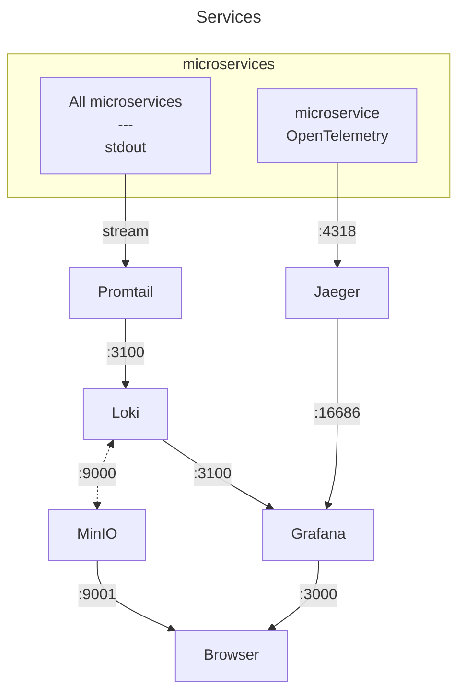
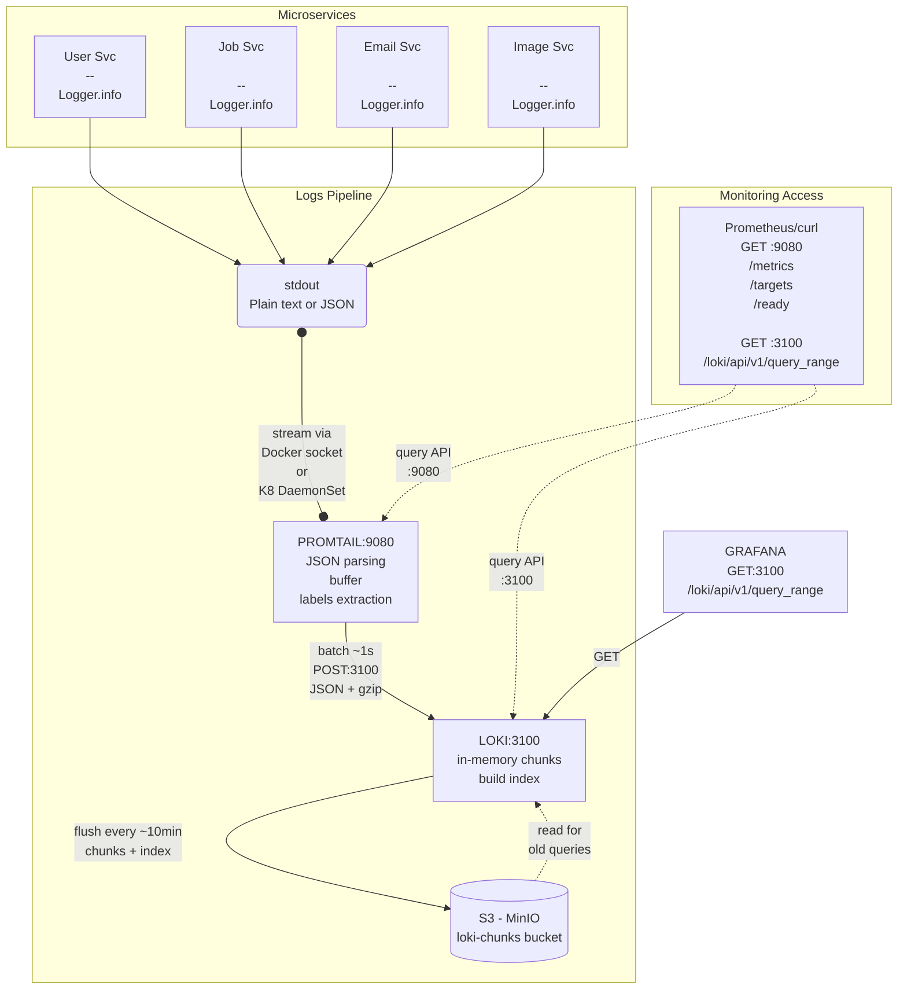
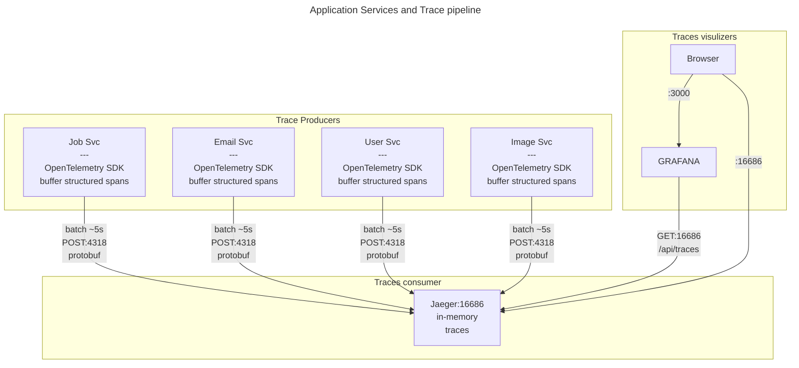
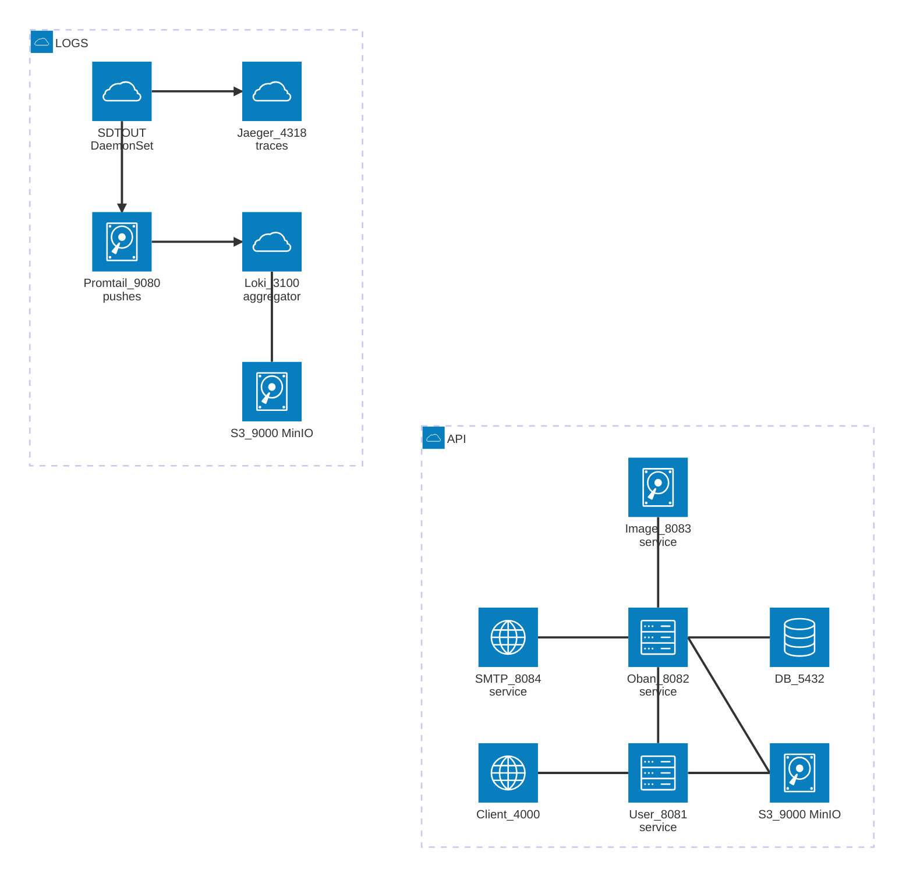
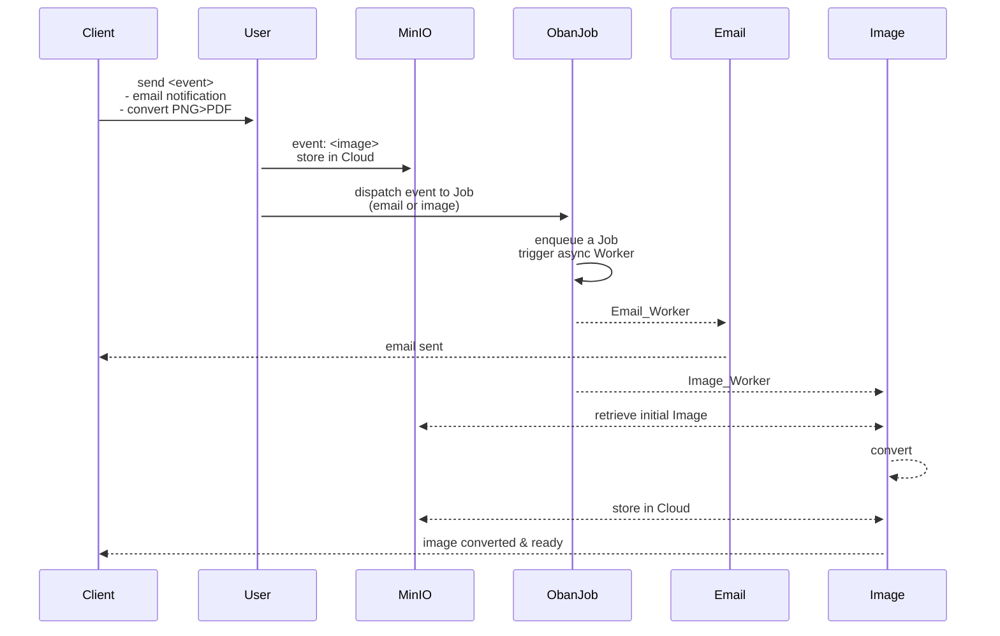

# Microservices with Elixir and HTTP "twirp" like communication

This is a demo of an **Plug/Elixir-based microservices architecture** demonstrating PNG-to-PDF image conversion with email notifications. The system uses:

- **Plug** only Elixir app (no Phoenix)
- **Bandit** for HTTP servers
- **Protobuf** for inter-service communication serialization
- **Oban** for background job processing backed with **SQLite**
- **Req** for HTTP client
- **Swoosh** for email delivery
- **ImageMagick** for image conversion
- **MinIO** for S3 compatible local-cloud storage
- **OpenTelemetry** with **Jaeger** for traces
- **Promtail** with **Loki** linked to MinIO for logs
- **Prometheus** for metrics
- **Grafana** for global dashboards

We run 5 Elixir apps as microservices communicating via **Protobuf serialization over HTTP/1**.
This provides strong type safety and a contract-first approach.

Routes follow a **Twirp-like RPC DSL** (`/service_name/MethodName`) instead of traditional REST (`/resource/`)

## Observability Stack

Firtly a quote:

> "Logs, metrics, and traces are often known as the three pillars of observability. While plainly having access to logs, metrics, and traces doesn’t necessarily make systems more observable, these are powerful tools that, if understood well, can unlock the ability to build better systems."

| System | Purpose | Data Type | Retention |
| --     | --        | --        | --        |
| Prometheus | Metrics | Numbers (counters, gauges)| Days/Weeks |
| Loki| Logs| Text events| Days/Weeks |
| Jaeger |Traces| Request flows | Hours/Days |

Pormetheus via `:promex`. We named "prometheus" the datasource name in the onfiguration file _prometheus.yml_  under the key `:uid`.

```sh
mix prom_ex.gen.config --datasource prometheus

mix prom_ex.dashboard.export --dashboard application.json --module UserSvc.PromEx --file_path ../../grafana/dashboards/user_svc_application.json

for service in job_svc image_svc email_svc client_svc; do
  cd apps/$service
  mix prom_ex.dashboard.export --dashboard application.json --module "$(echo $service | sed 's/_\([a-z]\)/\U\1/g' | sed 's/^./\U&/').PromEx" --stdout > ../../grafana/dashboards/${service}_application.json
  mix prom_ex.dashboard.export --dashboard beam.json --module "$(echo $service | sed 's/_\([a-z]\)/\U\1/g' | sed 's/^./\U&/').PromEx" --stdout > ../../grafana/dashboards/${service}_beam.json
  cd ../..
done
```

- METRICS: `Prometheus`
  "How much CPU/memory/time?
  "What's my p95 latency?"
  "How many requests per second?"
  "Is memory usage growing?"
  "Which endpoint is slowest?"

- LOGS: `Loki`
  Centralized logs from all services
  "Show me all errors in the last hour"
  "What did user X do?"
  "Find logs containing 'timeout'"
  "What happened before the crash?"

- TRACING: `Jaeger`
  Full journey accross services
  "Which service is slow in this request?"
  "How does a request flow through services?"
  "Where did this request fail?"
  "What's the call graph?"

> We used RPC-style endpoints (not RESTful API with dynamic segments) which makes observability easy (no `:id` in static paths).

|   System    |   Model     |   Format    |    Storage      |
|--           | --          | --          |--               |
| Prometheus  | PULL (scrape)| Plain text  | Disk (TS-DB)     |
|  | GET /metrics Every 15s | key=value   | prometheus-data  |
| Loki via Promtail       | PUSH  Batched       | JSON (logs) structured| MinIO (S3) loki-chunks     |
| Jaeger      | PUSH OTLP        | Protobuf (spans)   │|Memory only! Lost on restart   |
| Grafana     | N/A (UI)     | N/A         | SQLite   (dashboards only)       |

Tracing: headers are injected to follow the trace

## Misc tips & tricks

- protobuf: set `pass: ["application/protobuf"]` in the Plug.Parsers in the module _router.ex_ .
- follow trace async/Oban worker: add "_otel_trace_context" to your Oban job args
- PromEx datasource: use the value in datasource.name (and uid) for /grafana/provisioning/datasources/datasources.yml, and in /prom_ex.ex/ dashboard_assigns()[:datasource]
- generate the standard Promex dshboards.
- respect Grafana folder structure: _grafana/provisioning/{datasources,dashboards,plugins,notifiers}_.

### Services


<details>
<summary>Containers</summary>



</details>

### Logs pipeline


<details>
<summary>Logs pipeline</summary>



</details>

### Trace pipeline


<details>
<summary>CTrace pipeline</summary>



</details>

If you run  locally with Docker, you can use the Docker daemon and use a `loki` driver to read and push the logs from stdout (in the docker socket) to Loki. We used instead `Promtail` to consume the logs and push them to Loki. This solution is more K8 ready.

> To use a local `loki` driver, we need to isntall it:

```sh
docker plugin install grafana/loki-docker-driver:latest --alias loki --grant-all-permissions
```

## Prerequisites

Before running this project, ensure you have the following installed on your system:

- **Elixir** ~> 1.19 (with Erlang/OTP)
- **Protocol Buffers Compiler** (`protoc`) - [Installation guide](https://grpc.io/docs/protoc-installation/)
- **ImageMagick** - Required for PNG/JPEG to PDF conversion

  ```bash
  # macOS
  brew install imagemagick

  # Ubuntu/Debian
  sudo apt-get install imagemagick

  # Verify installation
  magick --version
  ```

- **SQLite3** - For Oban job queue (usually pre-installed on most systems)
- **Docker** - Required for running MinIO (S3-compatible object storage)

  ```bash
  # Option 1: OrbStack (recommended for macOS)
  brew install orbstack

  # Option 2: Docker Desktop
  brew install docker

  # Verify installation
  docker --version
  docker compose version  # Should show Compose V2
  ```

  **Note**: This project uses `docker compose` (V2 plugin) which works with both OrbStack and Docker Desktop.

### Quick Setup

```sh
# 1. Start MinIO (S3-compatible storage)
./setup_minio.sh

# 2. Test MinIO connection
elixir test_storage_simple.exs

# 3. Install dependencies for each service
cd user_svc && mix deps.get
cd ../job_svc && mix deps.get
# ... repeat for other services

# 4. Generate protobuf files from /protos (single source of truth)
# Note: protoc creates the protos/ subdirectory automatically
for svc in user_svc job_svc email_svc image_svc client_svc; do
  protoc --elixir_out=./$svc/lib/ --proto_path=. protos/*.proto
done
```

See [MINIO_SETUP.md](MINIO_SETUP.md) for detailed MinIO configuration and troubleshooting.

## API Documentation

### OpenAPI Specifications

All services provide OpenAPI 3.0 specifications for their HTTP endpoints. While the services communicate internally via **Protobuf binary serialization** (`application/x-protobuf`), the OpenAPI specs document the HTTP interface and contract.

**Available Specifications**:

- 📘 **[user_svc.yaml](openapi/user_svc.yaml)** - User orchestration service (port 8081)
- 📗 **[job_svc.yaml](openapi/job_svc.yaml)** - Oban job queue service (port 8082)  
- 📙 **[email_svc.yaml](openapi/email_svc.yaml)** - Email delivery service (port 8083)
- 📕 **[image_svc.yaml](openapi/image_svc.yaml)** - Image processing service (port 8084)

> **Note**: Only `image_svc` currently implements **OpenApiSpex** runtime spec generation. Other services have manually maintained YAML specs. See [Future Work](#future-work) for plans to unify.

### Viewing Documentation

**Quick Access** (when running Docker Compose):

```bash
# Start all services
docker compose up -d

# Access the documentation hub
open http://localhost:8080   # Or visit openapi/index.html
```

**Interactive Documentation**:

| Tool | URL | Best For |
|------|-----|----------|
| 🎨 **Redoc** | http://localhost:8080 | Beautiful reading experience, onboarding |
| 🧪 **Swagger UI** | http://localhost:8085 | Interactive API testing ("Try it out" button) |
| 📄 **Landing Page** | [openapi/index.html](openapi/index.html) | Quick links to all services & observability |

**Swagger UI Service Selector**:

```txt
http://localhost:8085
├── User Service (8081)    ← Dropdown selector
├── Job Service (8082)
├── Email Service (8083)
└── Image Service (8084)
```

**Redoc Direct Links** (specify YAML via query param):

```txt
http://localhost:8080?url=specs/user_svc.yaml
http://localhost:8080?url=specs/job_svc.yaml
http://localhost:8080?url=specs/email_svc.yaml
http://localhost:8080?url=specs/image_svc.yaml
```

### OpenApiSpex Implementation Status

| Service | OpenApiSpex Runtime | Manual YAML | Notes |
|---------|:------------------:|:-----------:|-------|
| image_svc | ✅ Yes | ✅ Yes | Full runtime spec + schemas |
| user_svc | ❌ No | ✅ Yes | Dependency installed, not implemented |
| job_svc | ❌ No | ✅ Yes | Dependency installed, not implemented |
| email_svc | ❌ No | ✅ Yes | Dependency installed, not implemented |
| client_svc | ❌ No | ❌ No | Test client only, no spec needed |

**image_svc Implementation** (reference example):

```elixir
# lib/api_spec.ex - OpenAPI spec definition
defmodule ImageSvc.ApiSpec do
  alias OpenApiSpex.{Info, OpenApi, Server}
  
  def spec do
    %OpenApi{
      info: %Info{
        title: "Image Service API",
        version: "1.0.0"
      },
      servers: [%Server{url: "http://localhost:8084"}],
      paths: Paths.from_router(ImageSvc.Router)
    }
  end
end

# lib/router.ex - Serve spec at /openapi
plug(OpenApiSpex.Plug.PutApiSpec, module: ImageSvc.ApiSpec)

get "/openapi" do
  conn
  |> put_resp_content_type("application/json")
  |> send_resp(200, Jason.encode!(ImageSvc.ApiSpec.spec()))
end

# lib/conversion_controller.ex - Document endpoint
use OpenApiSpex.ControllerSpecs

operation :convert,
  summary: "Convert image to PDF",
  request_body: {"Image conversion request", "application/x-protobuf", ImageConversionRequestSchema},
  responses: [
    ok: {"Conversion successful", "application/x-protobuf", ImageConversionResponseSchema}
  ]
```

See [openapi/README.md](openapi/README.md) for detailed documentation setup and usage.

## Architecture Overview


<details>
<summary>Architecture</summary>



</details>

### Services

#### 1. **client_svc** (Port 4000)

- **Purpose**: External client interface for testing
- **Key Features**:
  - User creation with concurrent streaming
  - PNG conversion testing client
  - Receives final workflow callbacks
- **Endpoints**: `/client_svc/ReceiveNotification`

#### 2. **user_svc** (Port 8081)

- **Purpose**: Entry point for user operations and workflow orchestration
- **Key Features**:
  - User creation and email job triggering
  - Image conversion workflow orchestration
  - In-memory image storage with presigned URLs
  - Completion callback relay to clients
- **Endpoints**:
  - `/user_svc/CreateUser`
  - `/user_svc/ConvertImage`
  - `/user_svc/ImageLoader/:storage_id`
  - `/user_svc/ConversionComplete`

#### 3. **job_svc** (Port 8082)

- **Purpose**: Background job processing orchestrator
- **Key Features**:
  - Oban-based job queue (SQLite database)
  - Email worker for welcome emails
  - Image conversion worker
  - Job retry logic and monitoring
- **Endpoints**:
  - `/job_svc/SendEmail`
  - `/job_svc/ConvertImage`
  - `/job_svc/EmailNotification`

#### 4. **email_svc** (Port 8083)

- **Purpose**: Email delivery service
- **Key Features**:
  - Swoosh email delivery
  - Email templates (welcome, notification, conversion complete)
  - Delivery callbacks
- **Endpoints**: `/email_svc/DeliverEmail`

#### 5. **image_svc** (Port 8084)

- **Purpose**: Image conversion service
- **Key Features**:
  - PNG/JPEG to PDF conversion using ImageMagick
  - Quality settings (low/medium/high/lossless)
  - Metadata stripping and image resizing
  - URL-based image fetching
- **Endpoints**: `/image_svc/ConvertImage`

## Technology Stack

### Protobuf

The messages are exchanged in _binary_ form, as opposed to standard plain JSON text.

Why `protobuf`?

- **Type Safety**: Defines a contract on the data being exchanged
- **Efficiency**: Better compression and serialization speed compared to JSON
- **Simple API**: Mainly 2 methods: `encode` and `decode`
- **Human Readable**: Decoded messages are human readable for debugging

The main reason of using this format is for _type safety_ here, not for speed (favor `messagepack`) nor for lowering message size (as opposed to JSON text).

The proto files clearly _document_ the contract between services.

**Example protobuf schema** (`email.proto`):

```proto
syntax = "proto3";
package mcsv;

message EmailRequest {
  string user_id = 1;
  string user_name = 2;
  string user_email = 3;
  string email_type = 4;  // "welcome", "notification"...
  map<string, string> variables = 5;  // Template variables
}

message EmailResponse {
  bool success = 1;
  string message = 2;
  string email_id = 3; 
  int64 timestamp = 4;
}
```

#### Protobuf in Practice: Encode/Decode Pattern

We use a **Twirp-like RPC DSL** instead of traditional REST.

Routes are named after the service method (e.g., `/email_svc/SendEmail`) rather than REST resources (e.g., `/emails`).

**Router Setup** ([email_svc/lib/router.ex:15](email_svc/lib/router.ex#L15)):

```elixir
post "/email_svc/SendEmail" do
  DeliveryController.send(conn)
end
```

**Callback Controller**

**Decode Request** ([email_svc/lib/delivery_controller.ex:10-14](email_svc/lib/delivery_controller.ex#L10-L14)):

```elixir
def send(conn) do
  {:ok, binary_body, conn} = Plug.Conn.read_body(conn)

  # Decode protobuf binary → Elixir struct with pattern matching
  %Mcsv.EmailRequest{
    user_name: name,
    user_email: email,
    email_type: type
  } = Mcsv.EmailRequest.decode(binary_body)

  # Process the request...
end
```

**Encode Response** ([email_svc/lib/delivery_controller.ex:34-43](email_svc/lib/delivery_controller.ex#L34-L43)):

```elixir
# Build response struct and encode to binary
response_binary =
  %Mcsv.EmailResponse{
    success: true,
    message: "Welcome email sent to #{email}"
  }
  |> Mcsv.EmailResponse.encode()

# Send binary response with protobuf content type
conn
|> put_resp_content_type("application/protobuf")
|> send_resp(200, response_binary)
```

**Key Points**:

- **Decode**: `binary_body |> Mcsv.EmailRequest.decode()` → Elixir struct
- **Encode**: `%Mcsv.EmailResponse{...} |> Mcsv.EmailResponse.encode()` → binary
- **Content-Type**: Always `application/protobuf` for both request and response
- **Pattern Matching**: Decode directly into pattern-matched variables for clean code
- **RPC-Style Routes**: `/service_name/MethodName` (Twirp convention) instead of REST `/resources`

### Transport

When you use protobuf to serialize your messages, you are almost ready to use `gRPC` modulo the "rpc's" implementation.

However, we use **HTTP/1** because `gRPC` brings overhead and even latency when compared to HTTP for small to medium projects (check <https://www.youtube.com/watch?v=uH0SxYdsjv4>).

This means each app runs:

- A webserver: **Bandit** (HTTP server)
- An HTTP client: **Req** (HTTP client)

Communication pattern:

- HTTP POST with `Content-Type: application/protobuf`
- Binary protobuf encoding/decoding
- Synchronous request-response + async job processing

## Setup

### Protobuf utilities

First, ensure you have the `protoc` compiler installed on your system (see [Protocol Buffers installation guide](https://grpc.io/docs/protoc-installation/)).

Then install the protobuf compiler plugin for Elixir:

```sh
mix escript.install hex protobuf 0.15.0
```

Add the protobuf dependency to each service's `mix.exs`:

```elixir
{:protobuf, "~> 0.15.0"}
```

An example of a _proto_ file `email.proto` that you design:

```proto
syntax = "proto3";
package mcsv;

message EmailRequest {
  string user_id = 1;
  string user_name = 2;
  string user_email = 3;
  string email_type = 4;  // "welcome", "notification", "user_updated"
  map<string, string> variables = 5;  // Template variables
}

message EmailResponse {
  bool success = 1;
  string message = 2;
  string email_id = 3;  // For tracking
  int64 timestamp = 4;
}
```

**Important**: All `.proto` files are in the `/protos` directory (single source of truth). We generate `*.pb.ex` files for each service that needs them.

We then generate an `email.pb.ex` for Elixir that we want to place in two app , job_service and email_service, as both app will communicate together and send messages of type `EmailRequest` and `EmailResponse`.

```sh
# Generate all protos for all services (run after modifying any .proto file)
# Note: protoc automatically creates lib/protos/ subdirectory from proto file path
for svc in user_svc job_svc email_svc image_svc client_svc; do
  for proto in protos/*.proto; do
    protoc --elixir_out=./$svc/lib/ --proto_path=. $proto
  done
done

# Or more concisely (generates all at once):
for svc in user_svc job_svc email_svc image_svc client_svc; do
  protoc --elixir_out=./$svc/lib/ --proto_path=. protos/*.proto
done
```

**Proto File Distribution**:

- `user.proto` → user_svc, job_svc, image_svc, client_svc
- `image.proto` → user_svc, job_svc, image_svc, client_svc
- `email.proto` → job_svc, email_svc
- `job.proto` → job_svc

These `*.pb.ex` files should be used in every app that uses this contract to exchange messages.

## Workflow Examples



### Workflow 1: Email Notification

This workflow demonstrates async email notifications using Oban and Swoosh. The system can handle 1000+ concurrent user creation events, each triggering a welcome email.


**Service Chain**: `client_svc` → `user_svc` → `job_svc` → `email_svc`

**Detailed Flow**:

1. **Client** → `user_svc/CreateUser` (protobuf: UserRequest)
2. **user_svc**:
   - Receives user data
   - Validates and processes user information
3. **user_svc** → `job_svc/SendEmail` (protobuf: EmailRequest)
   - Sends email job request with user details
4. **job_svc**:
   - Enqueues Oban job (EmailWorker)
   - Returns immediately (async from here)
   - Worker picks up job from SQLite queue
5. **EmailWorker** → `email_svc/DeliverEmail` (protobuf: EmailRequest)
6. **email_svc**:
   - Generates email from template (welcome, notification, etc.)
   - Sends via Swoosh mailer
7. **email_svc** → `job_svc/EmailNotification` (callback: EmailResponse)
   - Confirms delivery status
8. **job_svc** → `user_svc/ConversionComplete` (optional: notify completion)
9. **user_svc** → `client_svc/ReceiveNotification` (final callback)

**Key Features**:

- Concurrent request handling via `Task.async_stream`
- Async processing after job enqueue
- Oban retry logic for failed emails
- Callback chain for status tracking

### Workflow 2: PNG to PDF Conversion (Pull Model)

This workflow demonstrates efficient binary data handling using the "Pull Model" or "Presigned URL Pattern" (similar to AWS S3). Instead of passing large image binaries through the service chain, only metadata and URLs are transmitted.


**Key Patterns Demonstrated**:

- **Pull Model & Presigned URLs**: Image service fetches data on-demand via temporary URLs (using AWS S3 pattern)
- **Concurrent Flow**: `Task.async_stream` for parallel client requests and Oban for true async background jobs; workers poll the database independently, fully decoupled from the request flow with automatic retry logic.

**Problem**: We cannot pass the image binary through the chain as each step would copy the image, causing memory pressure.

**Solution**: The image service pulls data when needed via a presigned URL.

**Detailed Flow**:

1. **Client** → `user_svc/ConvertImage` (protobuf with image_data binary)
   - Only binary transfer to user service
2. **user_svc**:
   - Stores image in memory using Agent (ImageStorage GenServer)
   - Generates storage*id: `"job*#{UUID}"`
   - Creates presigned URL: `http://localhost:8081/user_svc/ImageLoader/{storage_id}`
   - Returns immediate acknowledgment to client
3. **user_svc** → `job_svc/ConvertImage` (protobuf with image_url, NO BINARY)
   - Tiny metadata request: `{image_url, user_id, user_email, quality, dimensions}`
4. **job_svc**:
   - Enqueues Oban job (ImageConversionWorker) with image_url
   - Returns immediately (async from here)
   - Worker picks up job from SQLite queue
5. **ImageConversionWorker** → `image_svc/ConvertImage` (protobuf with image_url, NO BINARY)
   - Passes URL reference and conversion options
6. **image_svc** → `user_svc/ImageLoader/{storage_id}` (HTTP GET)
   - Fetches the image binary on-demand (1st binary transfer)
   - Enables retry logic if fetch fails
7. **image_svc**:
   - Converts PNG → PDF using ImageMagick
   - Applies quality settings, resizing, metadata stripping
   - Measures processing metrics
8. **image_svc** → Returns PDF binary in response (2nd binary transfer)
9. **job_svc** → `email_svc/DeliverEmail` (sends completion notification)
10. **email_svc** → Sends "conversion complete" email to user
11. **job_svc** → `user_svc/ConversionComplete` (notifies completion)
12. **user_svc**:
    - Cleans up stored image from memory
    - Relays completion to client
13. **user_svc** → `client_svc/ReceiveNotification` (final callback with result)

**Key Benefits**:

- **Memory Efficiency**: Only 2 binary transfers (client→user, image_svc→user) instead of 5+
- **Retry Logic**: Image service can retry failed fetches without re-uploading
- **Scalability**: Intermediate services (job_svc) don't hold binary data
- **Temporary Storage**: Images auto-expire from memory after processing
- **URL-based**: Clean separation between data storage and processing

**Binary Transfer Summary**:

- ✅ Client → user_svc: Image binary (upload)
- ✅ image_svc ← user_svc: Image binary (on-demand fetch)
- ✅ image_svc → job_svc: PDF binary (result)
- ❌ user_svc → job_svc: NO binary (only URL)
- ❌ job_svc → image_svc: NO binary (only URL)

1. client_svc (local) → user_svc (Docker)
   POST /user_svc/CreateUser ✅ 200 in 25ms

2. user_svc → job_svc
   POST /job_svc/EnqueueEmail ✅ 200 in 15ms

3. job_svc → Oban (SQLite database we just fixed!)
   [EmailSenderController] Enqueued welcome email ✅

4. Oban Worker → email_svc
   POST /email_svc/SendEmail ✅ 200 in 1ms

5. email_svc → job_svc
   POST /job_svc/NotifyEmailDelivery ✅ 204 in 24ms

6. job_svc → user_svc
   POST /user_svc/NotifyEmailSent ✅ 204 in 20ms

7. user_svc → client_svc
   ❌ Failed: :nxdomain (EXPECTED - see below)

---

1. client_svc (local) → user_svc (Docker)
   POST /user_svc/ConvertImage ✅ 200 in 82ms

2. user_svc → MinIO
   Stored PNG: 1762116318739366_hyDntSpbYes.png (10011 bytes) ✅

3. user_svc → job_svc
   POST /job_svc/ConvertImage ✅ 200 in 15ms

4. Oban Worker (SQLite database we fixed!)
   [ImageConversionWorker] Processing conversion job 5 ✅

5. job_svc → image_svc
   POST /image_svc/ConvertImage ✅

6. image_svc → user_svc
   GET /user_svc/ImageLoader (fetch PNG from MinIO) ✅

7. ImageMagick Conversion
   PNG 1920x1080 → PDF (9610 bytes) ✅

8. image_svc → user_svc (the endpoint we just fixed!)
   POST /user_svc/StoreImage ✅ 200 in 10ms

9. user_svc → MinIO
   Stored PDF: 1762116318937316_7CjhIdQpjf8.pdf (9610 bytes) ✅

10. user_svc → client_svc
    ⚠️ :nxdomain (EXPECTED - client_svc is local, not in Docker)

## Docker setup

- Setup the `watch` in _docker-compose.yml_ (rebuilds on code change)

```yml
develop:
      watch:
        - action: rebuild
          path: ./apps/client_svc/lib
        - action: rebuild
          path: ./apps/client_svc/mix.exs
```

- Run the _watch_ mode:

```sh
docker compose up --watch
```

- Execute Elixir commands on the _client_service_ container:

```sh
docker exec -it msvc-client-svc bin/client_svc remote

# Interactive Elixir (1.19.2) - press Ctrl+C to exit (type h() ENTER for help)
# iex(client_svc@ba41c71bacac)1>
```

## Testing

Connect to the "msvc-client-svc" container and get an IEX session to run commands:

```sh
docker exec -it msvc-client-svc bin/client_svc remote

iex(client_svc@b6d94600b7e3)4> 
   Enum.to_list(1..20) 
   |> Task.async_stream(fn i -> Client.create(i) end, max_concurrency: 10, ordered: false) 
   |> Stream.run

# :ok
```

## COCOMO Complexity Analysis of this project

Tool: <https://github.com/boyter/scc>

───────────────────────────────────────────────────────────────────────────────
Language            Files       Lines    Blanks  Comments       Code Complexity
───────────────────────────────────────────────────────────────────────────────
Elixir                103       7,097     1,066       901      5,130        267
JSON                   10      14,875         7         0     14,868          0
YAML                   10       1,386       104        78      1,204          0
Markdown                8       1,177       302         0        875          0
Docker ignore           5         204        47        54        103          0
Dockerfile              5         345        86        92        167         16
Protocol Buffe…         5         310        50        86        174          0
Shell                   3         128        23        17         88          3
HTML                    1         412        33         0        379          0
───────────────────────────────────────────────────────────────────────────────
Total                 150      25,934     1,718     1,228     22,988        286
───────────────────────────────────────────────────────────────────────────────
Estimated Cost to Develop (organic) $726,392
Estimated Schedule Effort (organic) 12.18 months
Estimated People Required (organic) 5.30
───────────────────────────────────────────────────────────────────────────────
Processed 683366 bytes, 0.683 megabytes (SI)
───────────────────────────────────────────────────────────────────────────────

## Production Considerations

### Observability Stack Overhead

**Development vs Production Balance**:

> ⚠️ *"You have more containers for observability than real services running!"*

This is intentional for the demo and typical for microservices in development:

| Environment | Services | Observability | Ratio |
|-------------|----------|---------------|-------|
| **This Demo** | 5 apps | 6 containers (Grafana, Prometheus, Loki, Jaeger, Promtail, MinIO) | 1:1.2 |
| **Production** | 50+ apps | Same 6 containers | 1:0.12 |

**Why This Makes Sense**:

1. **Observability scales horizontally, not per-service**:
   - 1 Prometheus scrapes 5 or 500 services equally well
   - 1 Loki aggregates logs from 5 or 5000 pods
   - 1 Jaeger traces 5 or 50 microservices

2. **Development parity** (The 12-Factor App):
   - Learn observability patterns early
   - Test dashboards/alerts before production
   - Debug with production-like tools

3. **Cost in production**:

```txt
5 Elixir apps × 512MB = 2.5GB
Observability stack    = 2GB (Prometheus/Loki data stores)
Total                  = 4.5GB

50 Elixir apps × 512MB = 25GB
Observability stack    = 3GB (same containers, more data)
Total                  = 28GB (~10% overhead)
```

**Production Optimization**:

**Production Optimization**:
- Use managed services (Datadog, New Relic, Grafana Cloud) to eliminate self-hosting
- Sidecar pattern (Promtail as DaemonSet in K8s) reduces per-pod overhead
- **Sampling strategies** for traces (10% of traffic vs 100% in dev)
- **Protocol optimization**:
  - **Current**: OTLP/HTTP (port 4318) - Easy to debug, reliable
  - **Production**: Switch to OTLP/gRPC (port 4317) - 2-5x faster, HTTP/2 multiplexing
  - **Metrics**: Consider StatsD/UDP (fire-and-forget, non-blocking) for high-volume metrics
  - **Why not UDP for traces?** Traces are critical for debugging; losing spans = incomplete request flows
  - **How to switch to gRPC**:
    ```bash
    # Option 1: Environment variables (recommended)
    OTEL_EXPORTER_OTLP_PROTOCOL=grpc
    OTEL_EXPORTER_OTLP_ENDPOINT=http://jaeger:4317
    
    # Option 2: .env file (copy from .env.example)
    echo "OTEL_PROTOCOL=grpc" >> .env
    echo "OTEL_ENDPOINT=http://jaeger:4317" >> .env
    docker compose up --build
    ```
  - **Note**: Requires `otlp_protocol` config update (already implemented in `user_svc`, replicate for other services)

### Container Count Breakdown

**Application Containers** (5):

- client_svc, user_svc, job_svc, email_svc, image_svc

**Infrastructure** (1):

- MinIO (S3-compatible storage)

**Observability** (6):

- Prometheus (metrics scraper + TSDB)
- Loki (log aggregator)
- Promtail (log shipper - would be K8s DaemonSet in prod)
- Jaeger (trace collector)
- Grafana (visualization UI)
- Swagger UI / Redoc (API documentation viewers)

**Total**: 12 containers (in production, observability would serve 100s of services)

---

## Future Work

### TODO API Documentation

- [ ] **Implement OpenApiSpex for all services**:
  - ✅ `image_svc` - Fully implemented with runtime spec generation
  - ⏳ `user_svc` - Dependency installed, add `ApiSpec` module + schemas
  - ⏳ `job_svc` - Dependency installed, add `ApiSpec` module + schemas  
  - ⏳ `email_svc` - Dependency installed, add `ApiSpec` module + schemas
  - ❌ `client_svc` - Not needed (test client only)

- [ ] **Auto-generate OpenAPI YAML from specs**:
  
```elixir
# Add to each service router
get "/openapi.yaml" do
   spec = MyService.ApiSpec.spec()
   yaml = OpenApiSpex.OpenApi.to_yaml(spec)
   send_resp(conn, 200, yaml)
end
```

- [ ] **Replace manual YAML with runtime-generated specs**:
  - Fetch from `/openapi.yaml` endpoint instead of static files
  - Single source of truth (code = documentation)

### Observability Enhancements

- [ ] **Add custom PromEx plugins** for business metrics:
  - Image conversion success rate
  - Email delivery latency
  - Job queue depth by worker type

- [ ] **Alerting rules**:
  - Prometheus AlertManager for threshold-based alerts
  - Integrate with PagerDuty/Slack

- [ ] **Log sampling** for production:
  - Sample 10% of successful requests
  - Keep 100% of errors/warnings

### Architecture Improvements

- [ ] **12-Factor App compliance** (Config in environment):
  - ✅ **Phase 1 Complete**: OTLP protocol configurable via `OTEL_PROTOCOL` env var
  - ✅ Created `.env.example` template for all configuration
  - ⏳ **Phase 2**: Refactor Dockerfiles to use `ARG PORT` instead of hardcoded `EXPOSE`
  - ⏳ **Phase 3**: Update `docker-compose.yml` to use env vars for all ports
  - 🎯 **Goal**: Single source of truth in `.env` file
  - 📖 **See**: [docs/12_FACTOR_REFACTORING.md](docs/12_FACTOR_REFACTORING.md) for implementation plan

- [ ] **Complete OTLP protocol configuration** for all services:
  - ✅ `user_svc` - Runtime protocol selection implemented
  - ⏳ `job_svc`, `image_svc`, `email_svc`, `client_svc` - Copy pattern from user_svc
  - Test gRPC vs HTTP performance (benchmark with K6)

- [ ] **Service mesh** (Istio/Linkerd):

- [ ] **Service mesh** (Istio/Linkerd):
  - Automatic mTLS between services
  - Circuit breaking and retries
  - Traffic splitting for canary deployments

- [ ] **gRPC migration** (for high-throughput scenarios):
  - Keep Protobuf messages (already defined!)
  - Replace HTTP/1 with HTTP/2 + gRPC
  - Benchmarks needed: gRPC overhead vs HTTP/1 simplicity

- [ ] **Event sourcing** for job_svc:
  - Replace Oban state transitions with event log
  - Better audit trail and replay capability
  - See explanation below ⬇️

### Testing

> **The Testing Pyramid**: Not just logs/metrics/traces - documentation and tests are often called the "4th and 5th pillars" of observable systems.

**Testing Levels** (in order of execution frequency):

1. **Static Analysis** (100% - every file save):
   - ✅ **Credo** (already configured) - Elixir linting
   - ✅ **Dialyzer** - Type checking
   - 📝 **ExDoc** - Documentation coverage
   - 🔒 **Sobelow** - Security analysis for Phoenix/Plug apps

2. **Unit Tests** (70% of test suite):
   - Test individual functions in isolation
   - Fast (<1ms per test), no external dependencies
   - Example: Test `ImageSvc.convert_to_pdf/2` with mock files

3. **Integration Tests** (20% of test suite):
   - Test multiple modules working together
   - May use real database (SQLite in your case)
   - Example: Test Oban job enqueuing → worker execution → email delivery

4. **Contract Tests** (Service boundaries):
   - ⚠️ **Critical for microservices!**
   - Verify Protobuf message compatibility between services
   - Tools: **Pact** (consumer-driven contracts)
   - Example: `user_svc` expects `job_svc` to accept `EmailRequest` with fields `user_id`, `user_email`

5. **End-to-End (E2E) Tests** (5% of test suite):
   - Full workflow across all services
   - Slow, brittle, but catches integration bugs
   - Example: Upload PNG → verify PDF in MinIO → check email sent

6. **Load/Performance Tests** (On-demand):
   - Tools: **K6**, **Locust**, **wrk**
   - Measure throughput, latency percentiles (p50, p95, p99)
   - Example: Can the system handle 1000 concurrent image conversions?

7. **Chaos Engineering** (Production-like environments):
   - **What it is**: Deliberately inject failures to verify resilience
   - **Tools**: Chaos Mesh, Gremlin, Toxiproxy
   - **Examples**:
     - Kill random containers (test retry logic)
     - Inject network latency (test timeouts)
     - Fill disk to 100% (test error handling)
     - Corrupt Protobuf messages (test validation)
   - **Goal**: Discover weaknesses before they cause outages

**Current State**:

| Test Type | Status | Priority |
|-----------|--------|----------|
| Unit Tests | ⚠️ Minimal | **High** - Add tests for controllers, workers |
| Integration Tests | ❌ Missing | **High** - Test Oban job workflows |
| Contract Tests | ❌ Missing | **Medium** - Protobuf schemas are contracts |
| E2E Tests | ❌ Missing | **Low** - Manual testing via IEx currently |
| Load Tests | ❌ Missing | **Medium** - Benchmark image conversion |
| Chaos Tests | ❌ Missing | **Low** - Only needed for production prep |

**Recommended Additions**:

- [ ] **ExUnit setup**:
  ```elixir
  # test/user_svc/user_controller_test.exs
  defmodule UserSvc.UserControllerTest do
    use ExUnit.Case, async: true
    
    test "CreateUser decodes protobuf and creates user" do
      binary = %Mcsv.UserRequest{name: "Alice", email: "alice@example.com"}
               |> Mcsv.UserRequest.encode()
      
      conn = conn(:post, "/user_svc/CreateUser", binary)
             |> put_req_header("content-type", "application/x-protobuf")
             |> UserSvc.Router.call([])
      
      assert conn.status == 200
      response = Mcsv.UserResponse.decode(conn.resp_body)
      assert response.success == true
    end
  end
  ```

- [ ] **Contract testing** (Pact):
  - Verify Protobuf contracts between services
  - Consumer-driven contract tests
  - Example: `user_svc` (consumer) → `job_svc` (provider)

- [ ] **Load testing** (K6/Locust):
  - Benchmark concurrent user creation (current manual: 1000+)
  - Identify bottlenecks in image conversion pipeline
  - Measure p95/p99 latency under load

- [ ] **Chaos engineering**:
  - Randomly kill containers to test resilience
  - Network latency injection (simulate slow S3)
  - Partition tolerance testing (split network)

---

## Event Sourcing vs Oban (Architectural Pattern)

### **Current: Oban (State-Based Job Queue)**

```elixir
# Oban stores CURRENT STATE in SQLite
jobs table:
id | state      | worker           | args
1  | completed  | EmailWorker      | %{user_id: 123}
2  | executing  | ImageWorker      | %{job_id: 456}
3  | failed     | ImageWorker      | %{job_id: 789}

# You know WHERE the job is NOW, but not HOW it got there
# Lost information: retries, who cancelled, why it failed, etc.
```

**Pros**:
- ✅ Simple to understand and use
- ✅ Built-in retry logic
- ✅ Low storage overhead (one row per job)
- ✅ Fast queries (index on `state`)

**Cons**:
- ❌ No audit trail (can't answer "who cancelled this job?")
- ❌ Can't replay history (can't reprocess from step 2)
- ❌ Hard to debug (lost intermediate states)

---

### **Alternative: Event Sourcing**

```elixir
# Instead of storing CURRENT state, store ALL EVENTS
events table:
id | job_id | event_type        | data                      | timestamp
1  | 456    | job_created       | %{user_id: 123}           | 2025-11-05 10:00:00
2  | 456    | job_enqueued      | %{queue: "default"}       | 2025-11-05 10:00:01
3  | 456    | job_started       | %{worker_pid: #PID<...>}  | 2025-11-05 10:00:05
4  | 456    | conversion_failed | %{error: "timeout"}       | 2025-11-05 10:01:00
5  | 456    | job_retried       | %{attempt: 2}             | 2025-11-05 10:02:00
6  | 456    | job_completed     | %{pdf_url: "s3://..."}    | 2025-11-05 10:02:30

# Current state = reduce(events)
# State at any time = reduce(events up to timestamp)
```

**Pros**:
- ✅ **Complete audit trail**: "Who did what, when, and why?"
- ✅ **Time travel**: Replay events to see state at any point
- ✅ **Debuggability**: See exact sequence of events leading to failure
- ✅ **Event-driven architecture**: Other services can subscribe to events
- ✅ **Analytics**: Answer business questions ("How many jobs fail on first attempt?")

**Cons**:
- ❌ **Complexity**: More code to write (event handlers, reducers)
- ❌ **Storage overhead**: 10x more rows (one per event vs one per job)
- ❌ **Query complexity**: Must reduce events to get current state
- ❌ **Learning curve**: Requires mental shift from CRUD to events

---

### **Example: Job Retry with Event Sourcing**

```elixir
# Traditional Oban (state update)
def handle_failure(job) do
  # Lost info: what was the error? how many times retried?
  Oban.update(job, %{state: "failed", attempts: job.attempts + 1})
end

# Event Sourcing (append events)
def handle_failure(job, error) do
  EventStore.append([
    %JobEvent{type: :job_failed, job_id: job.id, data: %{
      error: error,
      attempt: job.attempts,
      worker_pid: self(),
      timestamp: DateTime.utc_now()
    }},
    %JobEvent{type: :job_retried, job_id: job.id, data: %{
      next_attempt_at: DateTime.add(DateTime.utc_now(), 60, :second),
      retry_reason: "automatic_retry_policy"
    }}
  ])
end

# Later, you can ask:
# "Show me all jobs that failed due to timeout on their 3rd attempt"
EventStore.query(
  event_type: :job_failed,
  data: %{error: "timeout", attempt: 3}
)
```

---

### **When to Use Event Sourcing?**

**Good fit** (consider migrating):
- ✅ Need **audit trail** (compliance, debugging)
- ✅ Need **time travel** (replay events, reprocess data)
- ✅ **Complex workflows** (multiple state transitions)
- ✅ **Event-driven architecture** (pub/sub between services)
- ✅ **Analytics** on job behavior

**Stick with Oban if**:
- ✅ Simple job queue (send email, process image)
- ✅ Don't need history (current state is enough)
- ✅ Team is small (learning curve isn't worth it)
- ✅ Low volume (<10k jobs/day)

**Your case**: Oban is fine for now. Consider Event Sourcing if you need to answer:
- "Why did this job fail 3 times before succeeding?"
- "Replay all image conversions that failed due to MinIO timeout"
- "Show me jobs cancelled by user X in the last 30 days"

---

## Resources