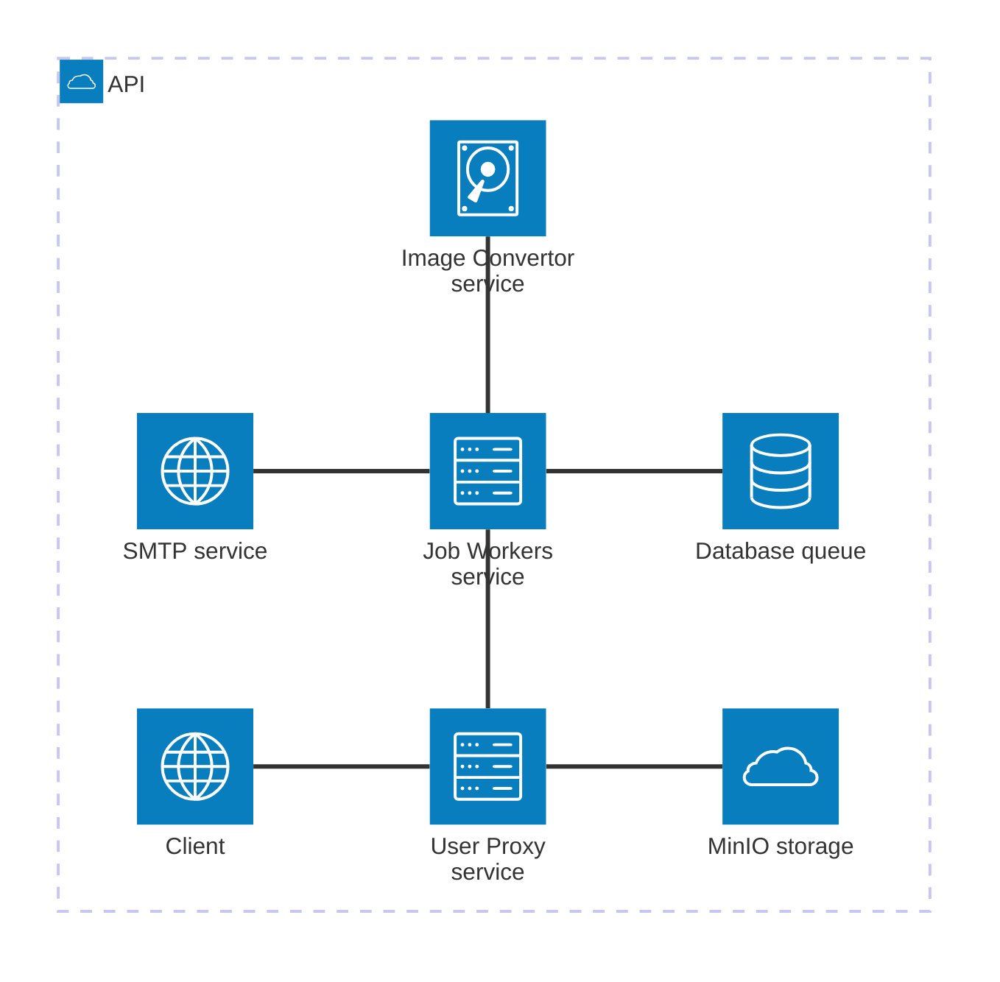

# Microservices with Elixir and HTTP "twirp" like communication

This is an **Elixir-based microservices architecture** demonstrating PNG-to-PDF image conversion with email notifications. The system uses:

- **Plug/Bandit** for HTTP servers
- **Protobuf** for inter-service communication serialization
- **Oban** for background job processing backed with **SQLite**
- **Req** for HTTP client
- **Swoosh** for email delivery
- **ImageMagick** for image conversion
- **MinIO** for S3 compatible local-cloud storage

We run 5 Elixir apps as microservices communicating via **Protobuf serialization over HTTP/1**, providing strong type safety and a contract-first approach.

Routes follow a **Twirp-like RPC DSL** (`/service_name/MethodName`) instead of traditional REST (`/resource/`)

**Observability Stack**

┌────────────────────────────────────────────────────----──┐
│ 1️⃣ TRACING (Jaeger) - "What path did the request take?"  │
│    ✅ http://localhost:16686                             │
│    └─ See full request journey across services           │
├────────────────────────────────────────────────----──────┤
│ 2️⃣ LOGS (Loki + Grafana) - "What happened and why?"      │
│    ✅ http://localhost:3000 (Grafana)                    │
│    └─ Centralized logs from all services                 │
│    └─ Filter by: service, request_id, level              │
├────────────────────────────────────────────────----──────┤
│ 3️⃣ METRICS (Prometheus) - "How much CPU/memory/time?"    │
│    🔧 Needs bucket fix in metrics.ex                     │
│    └─ Will show: CPU, memory, latency, request rate      │
└───────────────────────────────────────────────────----───┘

HTTP Request: GET /health
        │
        ├──> 📝 LOGS (Plug.Logger)
        │     └─> JSON → Loki → Grafana
        │         {"message":"GET /health", "request_id":"abc123"}
        │
        └──> 📊 METRICS (Plug.Telemetry)
              └─> Numbers → Prometheus
                  http_request_count{path="/health"} 1
                  http_request_duration_ms 15


Using driver `loki`: 

```sh
docker plugin install grafana/loki-docker-driver:latest --alias loki --grant-all-permissions
```

**Key Patterns Demonstrated**:

- **Pull Model & Presigned URLs**: Image service fetches data on-demand via temporary URLs (using AWS S3 pattern)
- **Concurrent Flow**: `Task.async_stream` for parallel client requests and Oban for true async background jobs; workers poll the database independently, fully decoupled from the request flow with automatic retry logic.

## Prerequisites

Before running this project, ensure you have the following installed on your system:

- **Elixir** ~> 1.19 (with Erlang/OTP)
- **Protocol Buffers Compiler** (`protoc`) - [Installation guide](https://grpc.io/docs/protoc-installation/)
- **ImageMagick** - Required for PNG/JPEG to PDF conversion

  ```bash
  # macOS
  brew install imagemagick

  # Ubuntu/Debian
  sudo apt-get install imagemagick

  # Verify installation
  magick --version
  ```

- **SQLite3** - For Oban job queue (usually pre-installed on most systems)
- **Docker** - Required for running MinIO (S3-compatible object storage)

  ```bash
  # Option 1: OrbStack (recommended for macOS)
  brew install orbstack

  # Option 2: Docker Desktop
  brew install docker

  # Verify installation
  docker --version
  docker compose version  # Should show Compose V2
  ```

  **Note**: This project uses `docker compose` (V2 plugin) which works with both OrbStack and Docker Desktop.

### Quick Setup

```bash
# 1. Start MinIO (S3-compatible storage)
./setup_minio.sh

# 2. Test MinIO connection
elixir test_storage_simple.exs

# 3. Install dependencies for each service
cd user_svc && mix deps.get
cd ../job_svc && mix deps.get
# ... repeat for other services

# 4. Generate protobuf files from /protos (single source of truth)
# Note: protoc creates the protos/ subdirectory automatically
for svc in user_svc job_svc email_svc image_svc client_svc; do
  protoc --elixir_out=./$svc/lib/ --proto_path=. protos/*.proto
done
```

See [MINIO_SETUP.md](MINIO_SETUP.md) for detailed MinIO configuration and troubleshooting.

## Architecture Overview


```mermaid
  info
```

<details>
<summary>Architecture</summary>



</details>


### Services

#### 1. **client_svc** (Port 4000)

- **Purpose**: External client interface for testing
- **Key Features**:
  - User creation with concurrent streaming
  - PNG conversion testing client
  - Receives final workflow callbacks
- **Endpoints**: `/client_svc/ReceiveNotification`

#### 2. **user_svc** (Port 8081)

- **Purpose**: Entry point for user operations and workflow orchestration
- **Key Features**:
  - User creation and email job triggering
  - Image conversion workflow orchestration
  - In-memory image storage with presigned URLs
  - Completion callback relay to clients
- **Endpoints**:
  - `/user_svc/CreateUser`
  - `/user_svc/ConvertImage`
  - `/user_svc/ImageLoader/:storage_id`
  - `/user_svc/ConversionComplete`

#### 3. **job_svc** (Port 8082)

- **Purpose**: Background job processing orchestrator
- **Key Features**:
  - Oban-based job queue (SQLite database)
  - Email worker for welcome emails
  - Image conversion worker
  - Job retry logic and monitoring
- **Endpoints**:
  - `/job_svc/SendEmail`
  - `/job_svc/ConvertImage`
  - `/job_svc/EmailNotification`

#### 4. **email_svc** (Port 8083)

- **Purpose**: Email delivery service
- **Key Features**:
  - Swoosh email delivery
  - Email templates (welcome, notification, conversion complete)
  - Delivery callbacks
- **Endpoints**: `/email_svc/DeliverEmail`

#### 5. **image_svc** (Port 8084)

- **Purpose**: Image conversion service
- **Key Features**:
  - PNG/JPEG to PDF conversion using ImageMagick
  - Quality settings (low/medium/high/lossless)
  - Metadata stripping and image resizing
  - URL-based image fetching
- **Endpoints**: `/image_svc/ConvertImage`

## Technology Stack

### Protobuf

The messages are exchanged in _binary_ form, as opposed to standard plain JSON text.

Why `protobuf`?

- **Type Safety**: Defines a contract on the data being exchanged
- **Efficiency**: Better compression and serialization speed compared to JSON
- **Simple API**: Mainly 2 methods: `encode` and `decode`
- **Human Readable**: Decoded messages are human readable for debugging

The main reason of using this format is for _type safety_ here, not for speed (favor `messagepack`) nor for lowering message size (as opposed to JSON text).

The proto files clearly _document_ the contract between services.

**Example protobuf schema** (`email.proto`):

```proto
syntax = "proto3";
package mcsv;

message EmailRequest {
  string user_id = 1;
  string user_name = 2;
  string user_email = 3;
  string email_type = 4;  // "welcome", "notification"...
  map<string, string> variables = 5;  // Template variables
}

message EmailResponse {
  bool success = 1;
  string message = 2;
  string email_id = 3; 
  int64 timestamp = 4;
}
```

#### Protobuf in Practice: Encode/Decode Pattern

We use a **Twirp-like RPC DSL** instead of traditional REST.

Routes are named after the service method (e.g., `/email_svc/SendEmail`) rather than REST resources (e.g., `/emails`).

**Router Setup** ([email_svc/lib/router.ex:15](email_svc/lib/router.ex#L15)):

```elixir
post "/email_svc/SendEmail" do
  DeliveryController.send(conn)
end
```

**Callback Controller**

**Decode Request** ([email_svc/lib/delivery_controller.ex:10-14](email_svc/lib/delivery_controller.ex#L10-L14)):

```elixir
def send(conn) do
  {:ok, binary_body, conn} = Plug.Conn.read_body(conn)

  # Decode protobuf binary → Elixir struct with pattern matching
  %Mcsv.EmailRequest{
    user_name: name,
    user_email: email,
    email_type: type
  } = Mcsv.EmailRequest.decode(binary_body)

  # Process the request...
end
```

**Encode Response** ([email_svc/lib/delivery_controller.ex:34-43](email_svc/lib/delivery_controller.ex#L34-L43)):

```elixir
# Build response struct and encode to binary
response_binary =
  %Mcsv.EmailResponse{
    success: true,
    message: "Welcome email sent to #{email}"
  }
  |> Mcsv.EmailResponse.encode()

# Send binary response with protobuf content type
conn
|> put_resp_content_type("application/protobuf")
|> send_resp(200, response_binary)
```

**Key Points**:

- **Decode**: `binary_body |> Mcsv.EmailRequest.decode()` → Elixir struct
- **Encode**: `%Mcsv.EmailResponse{...} |> Mcsv.EmailResponse.encode()` → binary
- **Content-Type**: Always `application/protobuf` for both request and response
- **Pattern Matching**: Decode directly into pattern-matched variables for clean code
- **RPC-Style Routes**: `/service_name/MethodName` (Twirp convention) instead of REST `/resources`

### Transport

When you use protobuf to serialize your messages, you are almost ready to use `gRPC` modulo the "rpc's" implementation.

However, we use **HTTP/1** because `gRPC` brings overhead and even latency when compared to HTTP for small to medium projects (check <https://www.youtube.com/watch?v=uH0SxYdsjv4>).

This means each app runs:

- A webserver: **Bandit** (HTTP server)
- An HTTP client: **Req** (HTTP client)

Communication pattern:

- HTTP POST with `Content-Type: application/protobuf`
- Binary protobuf encoding/decoding
- Synchronous request-response + async job processing

## Setup

### Protobuf utilities

First, ensure you have the `protoc` compiler installed on your system (see [Protocol Buffers installation guide](https://grpc.io/docs/protoc-installation/)).

Then install the protobuf compiler plugin for Elixir:

```sh
mix escript.install hex protobuf 0.15.0
```

Add the protobuf dependency to each service's `mix.exs`:

```elixir
{:protobuf, "~> 0.15.0"}
```

An example of a _proto_ file `email.proto` that you design:

```proto
syntax = "proto3";
package mcsv;

message EmailRequest {
  string user_id = 1;
  string user_name = 2;
  string user_email = 3;
  string email_type = 4;  // "welcome", "notification", "user_updated"
  map<string, string> variables = 5;  // Template variables
}

message EmailResponse {
  bool success = 1;
  string message = 2;
  string email_id = 3;  // For tracking
  int64 timestamp = 4;
}
```

**Important**: All `.proto` files are in the `/protos` directory (single source of truth). We generate `*.pb.ex` files for each service that needs them.

We then generate an `email.pb.ex` for Elixir that we want to place in two app , job_service and email_service, as both app will communicate together and send messages of type `EmailRequest` and `EmailResponse`.

```sh
# Generate all protos for all services (run after modifying any .proto file)
# Note: protoc automatically creates lib/protos/ subdirectory from proto file path
for svc in user_svc job_svc email_svc image_svc client_svc; do
  for proto in protos/*.proto; do
    protoc --elixir_out=./$svc/lib/ --proto_path=. $proto
  done
done

# Or more concisely (generates all at once):
for svc in user_svc job_svc email_svc image_svc client_svc; do
  protoc --elixir_out=./$svc/lib/ --proto_path=. protos/*.proto
done
```

**Proto File Distribution**:

- `user.proto` → user_svc, job_svc, image_svc, client_svc
- `image.proto` → user_svc, job_svc, image_svc, client_svc
- `email.proto` → job_svc, email_svc
- `job.proto` → job_svc

These `*.pb.ex` files should be used in every app that uses this contract to exchange messages.

## Workflow Examples


### Workflow 1: Email Notification

This workflow demonstrates async email notifications using Oban and Swoosh. The system can handle 1000+ concurrent user creation events, each triggering a welcome email.


**Service Chain**: `client_svc` → `user_svc` → `job_svc` → `email_svc`

**Detailed Flow**:

1. **Client** → `user_svc/CreateUser` (protobuf: UserRequest)
2. **user_svc**:
   - Receives user data
   - Validates and processes user information
3. **user_svc** → `job_svc/SendEmail` (protobuf: EmailRequest)
   - Sends email job request with user details
4. **job_svc**:
   - Enqueues Oban job (EmailWorker)
   - Returns immediately (async from here)
   - Worker picks up job from SQLite queue
5. **EmailWorker** → `email_svc/DeliverEmail` (protobuf: EmailRequest)
6. **email_svc**:
   - Generates email from template (welcome, notification, etc.)
   - Sends via Swoosh mailer
7. **email_svc** → `job_svc/EmailNotification` (callback: EmailResponse)
   - Confirms delivery status
8. **job_svc** → `user_svc/ConversionComplete` (optional: notify completion)
9. **user_svc** → `client_svc/ReceiveNotification` (final callback)

**Key Features**:

- Concurrent request handling via `Task.async_stream`
- Async processing after job enqueue
- Oban retry logic for failed emails
- Callback chain for status tracking

### Workflow 2: PNG to PDF Conversion (Pull Model)

This workflow demonstrates efficient binary data handling using the "Pull Model" or "Presigned URL Pattern" (similar to AWS S3). Instead of passing large image binaries through the service chain, only metadata and URLs are transmitted.


**Problem**: We cannot pass the image binary through the chain as each step would copy the image, causing memory pressure.

**Solution**: The image service pulls data when needed via a presigned URL.

**Detailed Flow**:

1. **Client** → `user_svc/ConvertImage` (protobuf with image_data binary)
   - Only binary transfer to user service
2. **user_svc**:
   - Stores image in memory using Agent (ImageStorage GenServer)
   - Generates storage*id: `"job*#{UUID}"`
   - Creates presigned URL: `http://localhost:8081/user_svc/ImageLoader/{storage_id}`
   - Returns immediate acknowledgment to client
3. **user_svc** → `job_svc/ConvertImage` (protobuf with image_url, NO BINARY)
   - Tiny metadata request: `{image_url, user_id, user_email, quality, dimensions}`
4. **job_svc**:
   - Enqueues Oban job (ImageConversionWorker) with image_url
   - Returns immediately (async from here)
   - Worker picks up job from SQLite queue
5. **ImageConversionWorker** → `image_svc/ConvertImage` (protobuf with image_url, NO BINARY)
   - Passes URL reference and conversion options
6. **image_svc** → `user_svc/ImageLoader/{storage_id}` (HTTP GET)
   - Fetches the image binary on-demand (1st binary transfer)
   - Enables retry logic if fetch fails
7. **image_svc**:
   - Converts PNG → PDF using ImageMagick
   - Applies quality settings, resizing, metadata stripping
   - Measures processing metrics
8. **image_svc** → Returns PDF binary in response (2nd binary transfer)
9. **job_svc** → `email_svc/DeliverEmail` (sends completion notification)
10. **email_svc** → Sends "conversion complete" email to user
11. **job_svc** → `user_svc/ConversionComplete` (notifies completion)
12. **user_svc**:
    - Cleans up stored image from memory
    - Relays completion to client
13. **user_svc** → `client_svc/ReceiveNotification` (final callback with result)

**Key Benefits**:

- **Memory Efficiency**: Only 2 binary transfers (client→user, image_svc→user) instead of 5+
- **Retry Logic**: Image service can retry failed fetches without re-uploading
- **Scalability**: Intermediate services (job_svc) don't hold binary data
- **Temporary Storage**: Images auto-expire from memory after processing
- **URL-based**: Clean separation between data storage and processing

**Binary Transfer Summary**:

- ✅ Client → user_svc: Image binary (upload)
- ✅ image_svc ← user_svc: Image binary (on-demand fetch)
- ✅ image_svc → job_svc: PDF binary (result)
- ❌ user_svc → job_svc: NO binary (only URL)
- ❌ job_svc → image_svc: NO binary (only URL)


1. client_svc (local) → user_svc (Docker)
   POST /user_svc/CreateUser ✅ 200 in 25ms

2. user_svc → job_svc
   POST /job_svc/EnqueueEmail ✅ 200 in 15ms

3. job_svc → Oban (SQLite database we just fixed!)
   [EmailSenderController] Enqueued welcome email ✅

4. Oban Worker → email_svc
   POST /email_svc/SendEmail ✅ 200 in 1ms

5. email_svc → job_svc
   POST /job_svc/NotifyEmailDelivery ✅ 204 in 24ms

6. job_svc → user_svc
   POST /user_svc/NotifyEmailSent ✅ 204 in 20ms

7. user_svc → client_svc
   ❌ Failed: :nxdomain (EXPECTED - see below)

---

1. client_svc (local) → user_svc (Docker)
   POST /user_svc/ConvertImage ✅ 200 in 82ms

2. user_svc → MinIO
   Stored PNG: 1762116318739366_hyDntSpbYes.png (10011 bytes) ✅

3. user_svc → job_svc
   POST /job_svc/ConvertImage ✅ 200 in 15ms
   
4. Oban Worker (SQLite database we fixed!)
   [ImageConversionWorker] Processing conversion job 5 ✅

5. job_svc → image_svc
   POST /image_svc/ConvertImage ✅

6. image_svc → user_svc
   GET /user_svc/ImageLoader (fetch PNG from MinIO) ✅

7. ImageMagick Conversion
   PNG 1920x1080 → PDF (9610 bytes) ✅

8. image_svc → user_svc (the endpoint we just fixed!)
   POST /user_svc/StoreImage ✅ 200 in 10ms

9. user_svc → MinIO
   Stored PDF: 1762116318937316_7CjhIdQpjf8.pdf (9610 bytes) ✅

10. user_svc → client_svc
    ⚠️ :nxdomain (EXPECTED - client_svc is local, not in Docker)